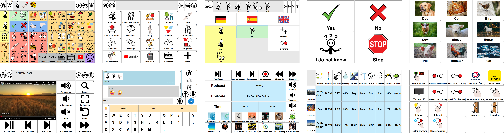

# AsTeRICS Grid

Create **grid-based user interfaces** that are **flexible and fully accessible**.

Use it for: 
* **Augmentative and Alternative Communication (AAC)**: very simple to highly complex communication boards
* **Media access**: browse and play YouTube, web radios, podcasts
* **Smart Home control**: operate devices directly or integrate with platforms like [openHAB](https://www.openhab.org/) or [HomeAssistant](https://www.home-assistant.io/)

**Accessible to everyone**: can be operated via **mouse click, touch, keyboard, single switch, or eye gaze** — adaptable to any user's abilities.

## Features

* **Cross-platform**: works on PC, smartphone, and tablet across Windows, Linux, Android, and iOS
* **No installation required**, just open [grid.asterics.eu](https://grid.asterics.eu/) in the browser (or install it to your desktop or home screen)
* **Offline capable**: works without an internet connection
* Optional **cloud sync**: synchronize your configuration across devices (with **end-to-end encryption**)
* **Customizable grid system**: flexible layouts tailored to any use case
* **Wide range of input methods**:  click, touch, hover, scanning, keyboard, switches — or advanced methods like eye tracking, head tracking, or EMG muscle sensors (via the [AsTeRICS Framework](https://www.asterics.eu/get-started/Overview.html))

### AAC-related features

* **Text-to-speech** in multiple languages (depending on the device)
* **Multilingual support**: build communicators that support different languages
* Integrated search for **free AAC symbols** from [ARASAAC](https://arasaac.org/) and [Open Symbols](https://www.opensymbols.org/)
* **Word forms**: enable automatic inflections (e.g. conjugations, plurals)
* **Customizable keyboards** with **word prediction** and **self-learning dictionaries**
* **Global grid**: define elements that appear across all pages (e.g. for core vocabulary)
* **Progressive language**: design communicators for various language development levels
* **Share created sentences** with any other app (e.g. WhatsApp)
* **Built-in messenger**: chat within the app using text, emojis, or pictograms – powered by [Matrix](https://matrix.org/)

### Smart Home and media access

* **Smart Home control**: directly via HTTP actions or connect with [openHAB](https://www.openhab.org/) or [HomeAssistant](https://www.home-assistant.io/)
* **Live elements**: display status of the app or external devices
* **Web radio**: play any radio station - powered by [radio-browser.info](http://www.radio-browser.info/gui/#!/)
* **Podcasts**: listen to any podcast - powered by [podcastindex.org]()
* **YouTube access**: search and play videos directly within the app

## Where to Use It

There are three online versions of AsTeRICS Grid:

* https://grid.asterics.eu/ current stable release
* https://grid.asterics.eu/latest/ current testing (beta) release, possibly unstable
* http://grid.asterics-foundation.org/ non-https version, but otherwise exactly the same app as https://grid.asterics.eu/ - may be used in cases where interaction with local resources (e.g. HTTP action) is needed and [browsers are refusing it because of mixed content](https://github.com/asterics/AsTeRICS-Grid/discussions/410). 

## Documentation
See [User documentation](docs/documentation_user/README.md) or [AsTeRICS Grid Playlist on YouTube](https://www.youtube.com/playlist?list=PL0UXHkT03dGrIHldlEKR0ZWfNMkShuTNz).

Also see [Developer documentation (not finished, maybe outdated)](docs/documentation_dev/README.md) and the [Collaboration guide](docs/documentation_dev/collaboration.md).

## Run project locally
1. clone the project `git clone git@github.com:asterics/AsTeRICS-Grid.git`
2. install node.js https://nodejs.org/
3. install yarn, see https://yarnpkg.com/
4. go to the directory of the cloned project and run `yarn install`
5. run `npm run start` and open http://localhost:9095

## Npm scripts
After `yarn install` the following commands are available:
1. `npm run start` --> starts a webserver serving the AsTeRICS grid on `http://localhost:9095`, does hot reloading if js-sources change.
2. `npm run build` --> builds the js-files in folder `src` to `app/build` folder.
3. `npm run start-auth` --> runs [couch-auth](https://github.com/perfood/couch-auth) locally and makes it possible to create "online users" within the locally running application. A local [CouchDb](https://couchdb.apache.org/) instance is necessary in order to work.
4. `npm run release` -> releases the current version with a new tag and push it to `gh-pages` branch in order to be served at https://grid.asterics.eu/
5. `npm run release-latest` -> same as `npm run release` but with destination https://grid.asterics.eu/latest/
5. `npm run test` -> runs tests of the project using [Jest](https://jestjs.io/).

## Support us
While development is currently funded within research projects (see below), the non-profit [AsTeRICS Foundation](https://www.asterics-foundation.org/) pays for the running server costs. If you want to contribute to these costs, you're very welcome to donate:

&nbsp;&nbsp;&nbsp;

## Acknowledgements and Attribution

AsTeRICS Grid was developed within several funded projects:
* **2018-2019:** project [Toolbox for Rapid Design of Smart Homes and Assistive Technologies (ToRaDes)](https://embsys.technikum-wien.at/projects/torades/index.php) at the [UAS Technikum Wien](https://www.technikum-wien.at/), funded by the [City of Vienna](https://www.wien.gv.at/kontakte/ma23/index.html), Project 18-04
* **2019-2023:** project [Knowledge Hub for Accessible Technologies (WBT)](https://embsys.technikum-wien.at/projects/khat/index.php) at the [UAS Technikum Wien](https://www.technikum-wien.at/), funded by the [City of Vienna](https://www.wien.gv.at/kontakte/ma23/index.html), Project 26-02
* **2022-2025:** project [Inclusion International (In2)](https://www.technikum-wien.at/forschungsprojekte/inclusion-international/) at the [UAS Technikum Wien](https://www.technikum-wien.at/), funded by the [City of Vienna](https://www.wien.gv.at/kontakte/ma23/index.html), Project 33-02
* **2024-2025:** [netidee project funding for AsTeRICS Grid](https://www.netidee.at/asterics-grid), Call 18
* **2024-2028:** project [Inclusion via digital augmentative and alternative communication (InDiKo)](https://www.technikum-wien.at/forschungsprojekte/indiko/) at the [UAS Technikum Wien](https://www.technikum-wien.at/), funded by the [City of Vienna](https://www.wien.gv.at/kontakte/ma23/index.html), Project 38-09

  

  

Other people and organizations we want to thank:
* Thanks to [ARASAAC](https://arasaac.org/) for collaborating and providing their pictogram API
* Thanks to [crowdin.com](https://crowdin.com/project/asterics-grid) for providing a free open source license
* Thanks to [browserstack.com](https://browserstack.com/) for providing us free UI tests on their platform.
* Thanks to Alex Segler for the great Webradio API [radio-browser.info](http://www.radio-browser.info/) which makes it possible to search and play webradios within AsTeRICS Grid
* Thanks to [podcastindex.org](https://podcastindex.org/) for a great global listing of podcasts and episodes
* Thanks to the makers of the API from [opensymbols.org](https://www.opensymbols.org/) which makes it possible to search for open AAC symbols within AsTeRICS Grid
* Thanks to ResponsiveVoice for providing an free non-commercial version, <a href="https://responsivevoice.org">ResponsiveVoice-NonCommercial</a> licensed under 
* Thanks to [open-meteo.com](https://open-meteo.com/), which provides free weather data, which can be displayed within AsTeRICS Grid
* Thanks to all the developers of these projects, which are all used by AsTeRICS Grid in production:
    * [couch-auth](https://github.com/perfood/couch-auth)
    * [file-saver](https://www.npmjs.com/package/file-saver)
    * [hls.js](https://github.com/video-dev/hls.js/)
    * [html2canvas](https://github.com/niklasvh/html2canvas)
    * [interactjs](https://interactjs.io/)
    * [jspdf](https://github.com/parallax/jsPDF)
    * [jszip](https://stuk.github.io/jszip/)
    * [matrix-js-sdk](https://github.com/matrix-org/matrix-js-sdk)
    * [n-ary-huffman](https://github.com/lydell/n-ary-huffman)
    * [navigo](https://github.com/krasimir/navigo)
    * [n-ary-huffman](https://github.com/lydell/n-ary-huffman)
    * [Object Model](https://objectmodel.js.org/)
    * [PouchDB](https://pouchdb.com/)
    * [predictionary](https://github.com/asterics/predictionary)
    * [Stanford Javascript Crypto Library (SJCL)](https://crypto.stanford.edu/sjcl/)
    * [superlogin-client](https://www.npmjs.com/package/superlogin-client)
    * [Vue.js](https://vuejs.org/)
    * [vue-i18n](https://vue-i18n.intlify.dev/)
    * [vue-multiselect](https://vue-multiselect.js.org/)
    * [Workbox](https://github.com/GoogleChrome/workbox)
    * [Bootstrap](https://getbootstrap.com/)
    * [fontawesome](https://fontawesome.com/)
    * [dom-i18n](https://github.com/ruyadorno/dom-i18n)
    * [jQuery](https://jquery.com/)
    * [jQuery context menu](https://swisnl.github.io/jQuery-contextMenu/)
    * [jQuery UI](https://jqueryui.com/)
    * [loglevel](https://github.com/pimterry/loglevel)

## License

AsTeRICS Grid and its source code are licensed under the [AGPL-3.0](./LICENSE). All documentation and non-source code in this repository are licensed under the [CC BY-SA 4.0](https://creativecommons.org/licenses/by-sa/4.0/deed.en).