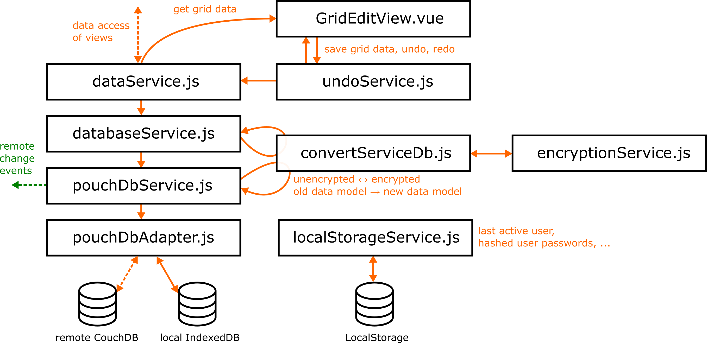

# Data storage
This chapter is about the data storage concept used in AsTeRICS Grid, meaning where and how user configuration and application data is stored.

1. [Introduction](06_data_storage.md#introduction)
1. [Abstraction layers](06_data_storage.md#data-storage-abstraction-layers)
1. [One database per user](06_data_storage.md#one-database-per-user)
1. [Authentication layer](06_data_storage.md#authentication-layer)
1. [Inspecting locally saved data](06_data_storage.md#inspecting-locally-saved-data)

[Back to Overview](README.md)

## Introduction
Since AsTeRICS Grid is designed to work offline, all configuration and user data have to be accessible without internet connection. There are the following possibilities for providing a data storage for an offline web-application:

1. Any external locally running storage service, e.g. any locally running database like MySQL or MariaDB. This possibility has the downside that users would have to install additional Software in order to use AsTeRICS Grid.
1. [LocalStorage](https://developer.mozilla.org/en-US/docs/Web/API/Window/localStorage), a browser internal storage which is capable to store key-value pairs of string values. However the amount of data is [limited to about 5-10MB](https://www.html5rocks.com/en/tutorials/offline/quota-research/) in many browsers which is often too little to store all grids in AsTeRICS Grid.
1. [IndexedDB](https://developer.mozilla.org/en-US/docs/Web/API/IndexedDB_API), a browser internal storage for big amounts of structured data

AsTeRICS Grid uses LocalStorage for temporary data which should not synchronized with the cloud (e.g. hashed encryption password) and IndexedDB for the majority of configuration like e.g. data of stored grids. For online users all data that is stored in IndexedDB is synchronized with the cloud, for offline users (see [Users](../documentation_user/06_users.md)) data is only stored locally on the device.

For accessing IndexedDB in a more comfortable manner and making synchronization with a remote [CouchDB](http://couchdb.apache.org/) possible, the Javascript library [PouchDB](https://pouchdb.com/) is used.

## Data storage abstraction layers
All Javascript modules regarding storage of data in AsTeRICS Grid can be found in the folder [src/js/service/data](https://github.com/asterics/AsTeRICS-Grid/tree/master/src/js/service/data). Figure 1 shows the relevant files and their relationships:

*Figure 1: Concept of data storage layers*

These are the responsibilities and functions of the different modules:

1. **dataService.js**: provides access to data objects on an application based abstraction level; implements methods that make it possible to get and save the objects described in chapter [Data model](05_datamodel.md), e.g. `GridData` objects.
1. **databaseService.js**: implements [CRUD](https://de.wikipedia.org/wiki/CRUD) methods for generic data model objects, methods for switching databases (users) and initializes databases with default data. This layer also does encryption and decryption of data using `filterService.js`. This level of abstraction is still quite independent of [PouchDB](https://pouchdb.com/) or [IndexedDB](https://developer.mozilla.org/en-US/docs/Web/API/IndexedDB_API) and theoretically could also use a different backend.
1. **pouchDbService.js**: performs queries and actions on a PouchDB instance actually accessing the IndexedDB or CouchDB databases. It also caches queries for performance optimizations and broadcasts events if updates from the remote database are recognized.
1. **pouchDBAdapter.js**: manages which actual database should be used, a local PouchDB instance or a remote CouchDB. Also sets up synchronization between both. 
1. **undoService.js**: is used by `grid.js` in order to pass updates on grids to `dataService.js` while keeping track of changes and providing an undo and redo functionality 
1. **filterService.js**: provides methods in order to convert objects used in the application to (encrypted) objects that should be saved to database and vice versa. If an object with an outdated data model version passes these methods, additional filter functions are inserted in order to upgrade the data model.
1. **encryptionService.js**: provides methods for AES encryption and decryption and hasing of data objects and strings using the [sjcl](https://github.com/bitwiseshiftleft/sjcl) library 
1. **localStorageService.js**: accesses the browser internal [LocalStorage](https://developer.mozilla.org/en-US/docs/Web/API/Window/localStorage) for saving data like the last active user or hashed user passwords - in general data which should not be synchronized to cloud or aren't suitable for a user's database.

## One database per user
AsTeRICS Grid implements the idea of [one database per user](https://www.joshmorony.com/creating-a-multiple-user-app-with-pouchdb-couchdb/). For each user a new database is created. Offline users have an own IndexedDB database within the browser and online users have both a local IndexedDB database and an online CouchDB database which are kept in sync by [replication features](https://pouchdb.com/guides/replication.html) of the PouchDB library. Advantages of this approach are:

* access rights are easy to manage, each user can access their own database and nothing else
* it's easy to delete all data of a user, just delete their database
* replication and synchronizing is simple, the whole user database can be replicated on the local device

## Authentication layer
The one-database-per-user approach needs a layer for managing user accounts and the corresponding CouchDB user databases (only for online users). For AsTeRICS Grid the framework [superlogin](https://github.com/sen-su/superlogin) is used. It provides an API in order to register and login users and creates the corresponding CouchDB databases in the background. However the [original superlogin project](https://github.com/colinskow/superlogin) seems to be no longer maintained and therefore AsTeRICS Grid uses a more up-to-date [fork](https://github.com/sen-su/superlogin) of it.

The file [superlogin/start.js](https://github.com/asterics/AsTeRICS-Grid/blob/master/superlogin/start.js) starts superlogin and contains it's configuration (= server side). The file [loginService.js](https://github.com/asterics/AsTeRICS-Grid/blob/master/src/js/service/loginService.js) is the client-side counterpart which uses the library [superlogin-client](https://www.npmjs.com/package/superlogin-client) in order to connect to and make use of the superlogin server.

In order to start superlogin a CouchDB instance must be running on the same machine and the correct CouchDB parameters have to be inserted in [start.js:43](https://github.com/asterics/AsTeRICS-Grid/blob/master/superlogin/start.js#L43). Then use `npm run start-superlogin-dev` or `npm run start-superlogin-prod` in order to start superlogin in development or production mode.

## Inspecting locally saved data
For examining the locally saved data of AsTeRICS Grid do the following (e.g. in Firefox or Chrome browser):
1. open developer tools (`Ctrl + Shift + I` or `right click -> Inspect`)
1. go to `Application` (Chrome) or `Web-Storage` (Firefox)
1. open `LocalStorage` or `IndexedDB` to inspect the data saved in these storages

[&#x2190; Previous Chapter](05_datamodel.md) [Next Chapter &#x2192;](07_i18n.md)

[Back to Overview](README.md)

