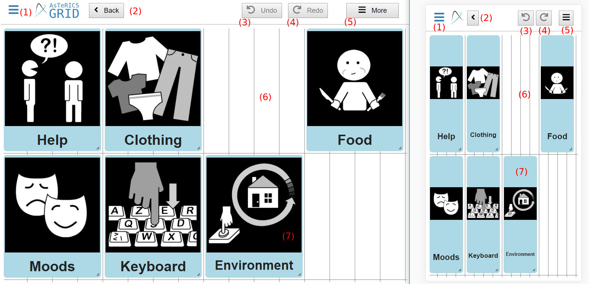
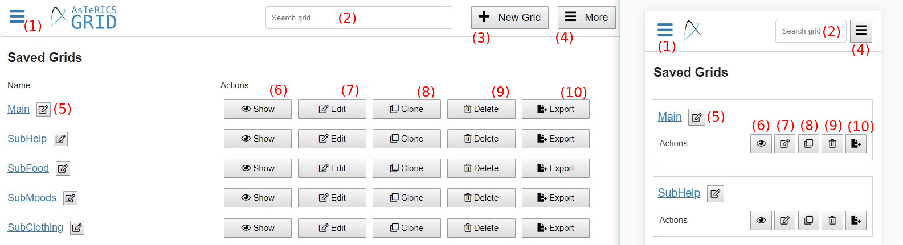
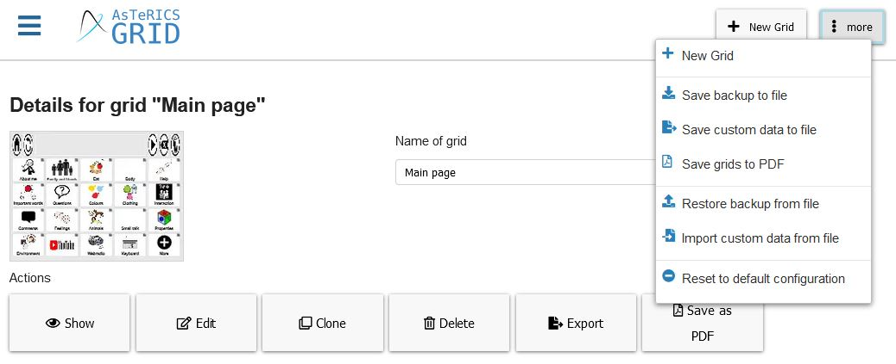
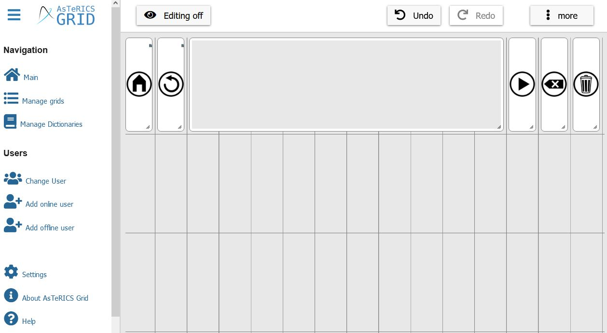

# Navigation and basic functionality

This chapter is about general appearance, navigation and basic functionality of the different views in AsTeRICS Grid:

1. [Welcome view](02_navigation.md#welcome-view): intial view shown at first usage
2. [Main view](02_navigation.md#main-view): starting view showing the recently used grid and navigation
3. [Edit view](02_navigation.md#edit-view): view that allows modification of a grid
4. [Manage grids view](02_navigation.md#manage-grids-view): show all grids, create new ones, create a backup
5. [Manage dictionaries view](02_navigation.md#manage-dictionaries-view): show, edit and create new dictionaries
6. [Change user view](02_navigation.md#change-user-view): switch users or login an existing one

[Back to Overview](README.md)

## Welcome view

**Video on YouTube:** [First Start](https://www.youtube.com/watch?v=5ffLB4a9APc&list=PL0UXHkT03dGrIHldlEKR0ZWfNMkShuTNz&index=2&t=0s) (German, but auto-translated subtitles available)

AsTeRICS Grid initially starts with a welcome view giving the choice between:

1. **Use AsTeRICS Grid without registration:** choose this option in order to create a local default user and directly start using AsTeRICS Grid.
2. **Register now:** choose this option in order to sign up for an online user, which makes it possible to synchronize the grids across devices.

See [Terms](01_terms.md#User) for more information about offline/online users.

## "Main" - view

**Videos on YouTube:** [Demo configuration](https://www.youtube.com/watch?v=OU4sI2UcNUo&list=PL0UXHkT03dGrIHldlEKR0ZWfNMkShuTNz&index=3&t=0s), [Fullscreen and lock mode](https://www.youtube.com/watch?v=CK8Lv2bVr-g&list=PL0UXHkT03dGrIHldlEKR0ZWfNMkShuTNz&index=4&t=0s) (German, but auto-translated subtitles available)

Once taken a decision in the welcome view AsTeRICS Grid subsequently starts in the "main view" which looks like Figure 1 (desktop view on the left, mobile view on the right):

*Fig. 1: "Main" - view (desktop view on the left, mobile view on the right)*

The elements have this functionality:

1. Open or close the left navigation sidebar
2. **Main**: navigate to the main view (currently shown)
3. **[Manage grids](02_navigation.md#manage-grids-view)**: show all grids of the current user, add new ones or backup them to a file, manage the global grid
4. **[Manage Dictionaries](02_navigation.md#manage-dictionaries-view)**: show all saved dictionaries, edit them or add new empty ones or import existing dictionaries
5. **[Change User](02_navigation.md#change-user-view)**: switch between saved users or log in an existing online user
6. **Add online user**: register a new online user (synchronized across devices), see [Users](06_users.md)
7. **Add offline users**: add a new offline user (only for this device)
8. **Settings**: select between general settings like application language and user settings like grid content language, voice or colors
9. **About AsTeRICS Grid**: Show general information, links, contact address
10. **Help**: find the AsTeRICS Grid user manuel, the ARASAAC tutorial or video tutorials
11. **[Editing on](02_navigation.md#edit-view)**: edit the layout of the grid, add new elements, actions for grid elements
12. **[Input options](04_input_options.md)**: Options about how to select grid elements (e.g. click, hover, scanning)
13. **Fullscreen**: hide the sidebar and the bar on the top, only showing the current grid 
14. **Lock**: lock the screen in order to prevent unintended input or changes beside using and navigating the grid 
15. **Grid**: demo grid consisting of some grid elements which are navigating to other grids if selected (possible for those which show the grey symbol in the upper right corner)

## Edit view - "Editing on"

**Video on YouTube:** [Add and edit elements](https://www.youtube.com/watch?v=KWwWgCgidXM&list=PL0UXHkT03dGrIHldlEKR0ZWfNMkShuTNz&index=13&t=0s) (German, but auto-translated subtitles available)

Clicking on Button "Editing on" (Fig. 1, number 11) opens the edit view where a grid can be adapted, see Figure 2:

*Fig.2: "Editing on" - view (desktop view on the left, mobile view on the right)*

The following elements are available in the edit view:

1. Open or close the navigation sidebar
2. **Editing off**: navigate back to main view
3. **Undo**: reverts the last action
4. **Redo**: redoes the last action after reverting it
5. **More**: opens a menu with additional actions, e.g adding new elements
6. **Right click on a grid element**: opens a menu for editing / deleting / etc.  the element (open it with long tap on a mobile device/touchscreen)
   
   **Reposition grid element / Edit area**: Grid elements can be repositioned by dragging them (drag & drop). On the right bottom corner it's possible to resize a grid element.

See page [Edit grid appearance and layout](03_appearance_layout.md) for more details about editing a grid.

## "Manage grids" - view

**Video on YouTube:** [Manage grids](https://www.youtube.com/watch?v=HQTgvv1Dnn0&list=PL0UXHkT03dGrIHldlEKR0ZWfNMkShuTNz&index=15&t=0s) (German, but auto-translated subtitles available)

The manage grids view provides an overview about the current grids of a user, see Figure 3:

*Fig.3: "Manage grids" - view (desktop view on the left, mobile view on the right)*

The following elements are available in the manage grids view:

1. Open or close the navigation sidebar
2. **Name of grid**: type name of the grid and confirm by clicking on the tick
3. **New grid**: add a new, empty grid
4. **more**: shows menu with additional actions, e.g. backup the grids to file or restore backups from file
5. **Show**: open this grid in main view
6. **Edit**: open this grid in edit view
7. **Clone**: duplicate this grid, creating a copy of it with a different name
8. **Delete**: delete this grid
9. **Export**: saves and downloads this specific grid to a `.grd` file creating a backup of it (saves only this single grid, see "More" menu (Number 4) to backup all grids)
10. **Save as PDF**: saves and downloades the grid as PDF
11. **Grids to show**: select which grids shall be shown in the grid list
12. **Sort grids by**: select how the grids in the grid list shall be sorted

### "more" button - Additional options

Clicking on Button "more" (Fig. 3, number 4) opens menu with additional options:

*Fig.3.1: "Manage grids" - view - "more" button*

These are the possible options:

1. **New Grid**: creates a new and empty grid, same as Fig. 3, number 3
2. **Save backup to file**: creates and downloads a `.grd` file containing a backup of all current grids, dictionaries and input configuration. In this case, a file called `asterics-grid-backup.grd` is downloaded that can be renamed to more easily identify the contents of the copy
3. **Save custom data to file**: creates and downloads a backup copy as well, but data can be customized with the following options: 
   1. Select grid: export a specific (group of) grid(s) or all available grids
   2. Export languages: select wheter to export all the languages in which the communicator is translated or only one of them (current content language)
   3. Export dictionaries: can be activated / deactivated
   4. Export user settings and input configuration: can be activated / deactivated (preserves specific adjustments like color settings, content language or input settings (scanning or direct slection))
   5. Export global grid: can be activated / deactivated 
4. **Save grids to PDF**: creates and downloads a `.pdf` file of one or all grids, which can be used for later printing
5. **Restore backup from file**: deletes the existing configuration and replaces it with data from a `.grd` file
6. **Import custom data from file**:  imports data from a `.grd` file as well, but data can be customized. You can choose if you want to import dictionaries, of you want to import user settings and input configuration and if oyu want to delet existing data before importing.
7. **Reset to default configuration**: deletes all current grids and replaces them with the default demo configuration

**Info about Open Board Format (OBF)**: OBF is an open format for exchanging grids across different AAC tools and is specified on the [official website](https://www.openboardformat.org/). AsTeRICS Grid supports importing OBF files (`.obf` and `.obz`) using the options *Restore backup from file* or *Import custom data from file*.

**Video on YouTube:** [Complex grids and OBF](https://www.youtube.com/watch?v=Tpez_-4ILRA&list=PL0UXHkT03dGrIHldlEKR0ZWfNMkShuTNz&index=26&t=0s) (German, but auto-translated subtitles available)

### Global grid

**Video on YouTube:** [Global Grid](https://www.youtube.com/watch?v=bbmMODbqbhk&list=PL0UXHkT03dGrIHldlEKR0ZWfNMkShuTNz&index=25&t=0s) (German, but auto-translated subtitles available)

A global grid is a grid that is visible on every grid page. It may contain general elements that make sense within every grid like e.g. a "Home" grid element that navigates to the start page. A global grid could also contain some kind of core vocabulary that should be visible any time. The global grid of the main page of figure 1 contains the following elements: 

*Fig.3.2: Global Grid*

All the elements shown here are elements contained within the global grid. They are visible on every grid page.
While editing the global grid it's possible to define its height by opening *More -> Change grid dimensions* and setting the value for *height of first global grid row*.

The global grid can be activated/deactivated and edited in the "Manage Grids" view at the bottom or by *More -> Edit global grid* while editing any other grid: 

*Fig.3.3: "Manage grids" - view - Global Grid*

## "Manage Dictionaries" - view

**Video on YouTube:** [Manage dictionaries](https://www.youtube.com/watch?v=DS9om8MDEDY&list=PL0UXHkT03dGrIHldlEKR0ZWfNMkShuTNz&index=19&t=0s) (German, but auto-translated subtitles available)

In the manage dictionaries view currently saved dictionaries that are used for filling prediction elements (see [Terms](01_terms.md#grid-element)) can be shown and adapted (Figure 4):

*Fig. 4: "Manage dictionaries" - view (desktop view on the left, mobile view on the right)*

The following elements are available in the manage dictionaries view:

1. Open or close the navigation sidebar
2. **Import dictionary**: imports a dictionary from online dictionaries or from a `.json` file
3. **New empty dictionary**: add a new, empty dictionary
4. **Edit**: show, edit and add new words to the dictionary
5. **Clone**: create a copy of the dictionary
6. **Delete**: removes the dictionary
7. **Save**: saves the dictionary as `.json` file
8. **Edit dictionary name**: change the name of a dictionary

For more information about using dictionaries see [Dictionaries](07_dictionaries.md).

## "Change User" - view

**Video on YouTube:** [Offline and online users](https://www.youtube.com/watch?v=CoRUQJJnYaY&list=PL0UXHkT03dGrIHldlEKR0ZWfNMkShuTNz&index=16&t=0s) (German, but auto-translated subtitles available)

In the "Change User" - view it's possible to switch between users or login an existing one (Figure 5):

*Fig. 5: "Change user" - view (desktop view on the left, mobile view on the right)*

The following elements are available in the change users view:

1. Open or close the navigation sidebar
2. **Active offline user**: the currently active user is recognizable by a black user symbol and the word "active" next to the username. The active user is the user whose grids and configuration are currently used and shown in all other views. 
3. **Inactive online user**: The little cloud symbol indicates an online user (see [Terms](01_terms.md#user)) and the gray user symbol that he is currently inactive, meaning that the user's grids are currently not used.
4. **Inactive offline user**: The gray user symbol without a cloud indicates an inactive offline user (see [Terms](01_terms.md#user))
5. **Open**: sets the user "active" and opens the main view, showing the user's grid(s). Sets all other users inactive, there is always only one active user.
6. **Delete**: deletes the user and all of his grids and configuration. Use with caution, this action cannot be undone. This option is only available for offline users.
7. **Logout**: deletes the user and all of his grids and configuration, but only on the current device. Data in the cloud and on other devices that are logged in with the same user will not be deleted. This option is only available for online users.
8. **Login with other user**: put in username and password of an existing online user in order to add it to the current device. In order to create a new online or offline user, follow one of the links below.
9. **Remember checkbox**: if checked, the newly logged in online user will be saved to the device and listed in the list of users in the current user view. If unchecked the user will only be opened temporarily and no user data will be saved on the device (recommended for logging in on foreign devices).

For information about offline or online users and how to add them see [Users](06_users.md).

[&#x2190; Previous Chapter](01_terms.md) [Next Chapter &#x2192;](03_appearance_layout.md)

[Back to Overview](README.md)
