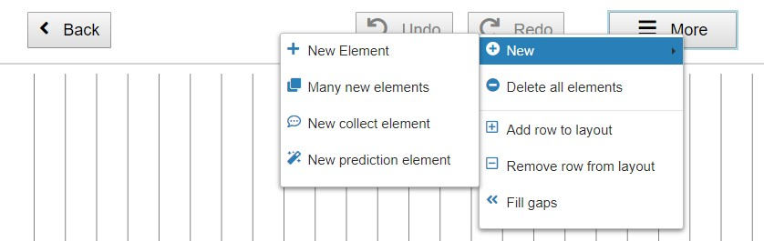
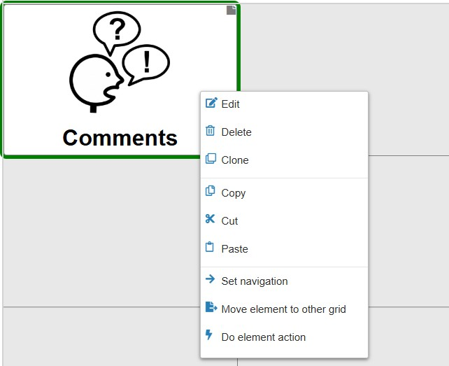
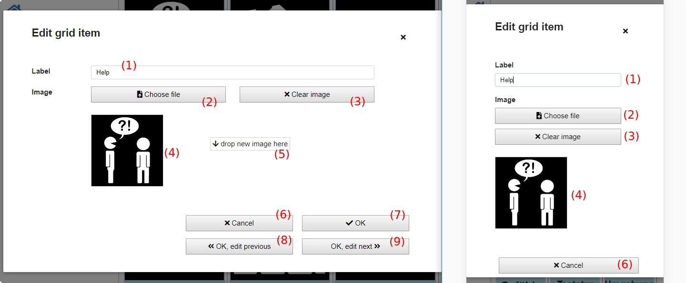

# Grid appearance and layout
**Videos on YouTube:** [Layout options](https://www.youtube.com/watch?v=Iw605fb85bs&list=PL0UXHkT03dGrIHldlEKR0ZWfNMkShuTNz&index=12&t=0s), [Collect elements](https://www.youtube.com/watch?v=X6YrWJW2ZoM&list=PL0UXHkT03dGrIHldlEKR0ZWfNMkShuTNz&index=21&t=0s), [Prediction elements](https://www.youtube.com/watch?v=t0FWZcM9TMg&list=PL0UXHkT03dGrIHldlEKR0ZWfNMkShuTNz&index=22&t=0s) (German, but auto-translated subtitles available)

This chapter is about a grid's layout and appearance and how to edit it:

1. [Adding elements and change the layout](03_appearance_layout.md#adding-elements-and-layout-options)
1. [Editing grid elements menu](03_appearance_layout.md#editing-grid-elements)
1. [Edit modal](03_appearance_layout.md#edit-modal): changing label and image

[Back to Overview](README.md)

## Adding elements and layout options
In the [Edit view](02_navigation.md#edit-view) the following menu opens on a click on "More":

*Fig. 1: Edit view - menu "More"*

These are the actions to select in the menu:

1. **New &#x2192; New Element**: creates a normal new element, opening a dialog where label and image can be defined
1. **New &#x2192; Many new elements**: creates multiple new normal elements at once, opening a dialog where multiple elements can be defined and inserted into the grid
1. **New &#x2192; New collect element**: creates a new collect element, see [Terms](01_terms.md#grid-element)
1. **New &#x2192; New prediction element**: creates a new prediction element, see [Terms](01_terms.md#grid-element)
1. **Delete all elements**: removes all grid elements from the grid
1. **Add row to layout**: adds a new row to the grid layout, e.g. creating a new third row for elements at the bottom in Figure 2 

1. **Remove row from layout**: removes the last row from the grid layout while keeping all grid elements. Applied to Figure 2 this would mean that afterwards there is only a single row where all six elements are placed. 

1. **Fill gaps**: moves all grid elements as far left as possible, closing gaps. Applied to Figure 2 this would result in moving "Food" to the left, closing the gap between "Food" and "Clothing". 

## Editing grid elements
A right click (or long tap) on a grid element in edit view opens the following menu:

*Fig. 2: Grid element menu*

These are the options to select:

1. **Edit**: opens a dialog to edit the label and the image of this element
1. **Actions**: opens a dialog to edit actions that should be performed if this element is selected, see [Grid actions](actions.md)
1. **Delete**: deletes this element
1. **More &#x2192; Duplicate**: inserts a copy of this element to the grid
1. **More &#x2192; Do element action**: performs the actions that are assigned to this grid element, e.g. speaking the label or navigating to another grid

## Edit modal
**Video on YouTube:** [Add and edit elements](https://www.youtube.com/watch?v=KWwWgCgidXM&list=PL0UXHkT03dGrIHldlEKR0ZWfNMkShuTNz&index=13&t=0s) (German, but auto-translated subtitles available)

Clicking on "Edit" in the grid element menu (Fig. 2) opens this modal, Figure 3:

*Fig. 3: Edit grid element modal*

These are the elements in the modal of Figure 3:

1. **Label**: change the label of the element shown under the image, can be empty
1. **Choose file**: opens a file dialog to choose a different image
1. **Clear image**: deletes the currently chosen image
1. **Image preview**: shows a small preview of the currently chosen image
1. **Drop area**: drag and drop image files in this area to select them. It's possible to drag and drop files from a file explorer or also other programs like e.g. METACOM MetaSearch*. 

1. **Cancel**: discard all changes and close the modal
1. **OK**: save all changes and close the modal
1. **OK, edit previous**: save all changes, edit the previous grid element in the edit modal
1. **OK, edit next**: save all changes, edit the next grid element in the edit modal

<a href="https://www.metacom-symbole.de/" target="_blank">*METACOM and MetaSearch</a> &copy; Annette Kitzinger

[&#x2190; Previous Chapter](02_navigation.md) [Next Chapter &#x2192;](04_input_options.md)

[Back to Overview](README.md)

