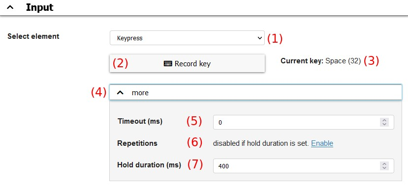
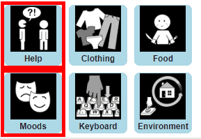

# Input Options
**Video on YouTube:** [Overview input options](https://www.youtube.com/watch?v=Y0itTyz-D5Y&list=PL0UXHkT03dGrIHldlEKR0ZWfNMkShuTNz&index=5&t=0s) (German, but auto-translated subtitles available)

This chapter is about how grid elements can be selected with different input modalities.

[Back to Overview](README.md)

Clicking on Button "Input Options" in [Main view](02_navigation.md#main-view) opens a menu with the following entries:
* **Mouse/Touch input:** options for input types like normal mouse click, tap or hovering
* **Scanning:** Input method for 1-2 input events, subsequently select groups of elements until one element is chosen
* **Direction input:** Input method for 2-5 input events, 1-4 input events for navigating in different directions, 1 input event for selecting an element
* **Huffman input:** 2-9 input events, assigns a code to each grid element which consists of an ordered sequence of the available input events
* **Sequential input:** 2 input events, one for navigating to the next element one for selecting the current element

## Introduction to input events
**Video on YouTube:** [Input actions and input events](https://www.youtube.com/watch?v=ZsBsifa2kwc&list=PL0UXHkT03dGrIHldlEKR0ZWfNMkShuTNz&index=6&t=0s) (German, but auto-translated subtitles available)

An input event in general is any kind of defined, single user interaction. AsTeRICS Grid currently supports the following input event types:
* **Keypress:** event of pressing a key on the keyboard, also can be a external button press using additional external hardware
* **AsTeRICS ARE event:** any event that is generated by a running model within the AsTeRICS Framework. This type of event is very flexible and can be e.g. eye movement, head movement or a signal of an EMG muscle activity sensor.

These types of input events can be used in all input methods except *Mouse/Touch input* where the input events are mouse movements and click/tap events.

### Keypress input events
Figure 1 shows the configuration possibilities of an keypress event:

*Fig. 1: Configuration of a keypress input event*

These are the shown elements and options:
1. **Dropdown**: allows to choose between *Keypress* or *AsTeRICS ARE* event 
1. **Record key**: click in order to start keyboard record mode. A subsequent keypress on the keyboard will be recorded and that key used for the event. 
1. **Current key**: prints the currently recorded/used key. *Digit1* means the `1` digit key on the keyboard. 
1. **More**: a accordion of additional options that can be opened/closed by a click 
1. **Timeout**: minimum pause in milliseconds between two subsequent actions (if faster, the second action is ignored). Mandatory if different *Repetitions* are set for the same key in order to wait for possible upcoming repetitions before performing the action.
1. **Repetitions**: the number of times the key has to be pressed in order to perform the action 
1. **Hold duration**: time in milliseconds how long a key has to be pressed in order to perform the action 

Note that it's not possible to set both *Repetitions* greater 1 and *Hold duration* greater 0 at the same time.

#### Usage examples
Here are some examples for the properties *Timeout*, *Repetitions* and *Hold duration* that could be useful in real use cases:
* **Different actions with same key (e.g. Space), distinction by hold duration:**
    * **Action 1**: Timeout=0, Repetitions=1, Hold Duration=0
    * **Action 2**: Timeout=0, Repetitions=1, Hold Duration=400
    * Pressing the key once performs action 1, Pressing and holding the key for 400ms performs action 2
    * This is the default configuration for input method *Scanning* where this configuration can be tested
* **Different actions with same key (e.g. Space), distinction by repetition:**
  * **Action 1**: Timeout=0, Repetitions=1, Hold Duration=0
  * **Action 2**: Timeout=300, Repetitions=2, Hold Duration=0
  * Pressing the key once and waiting 300ms performs action 1, pressing the key twice (with less than 300ms pause) performs action 2
* **Filter unintended keypresses**
  * **all actions**: Timeout=0, Repetitions=1, Hold Duration=300
  * any unintended keypresses are ignored and actions are only performed if a key is pressed longer than 300ms

### AsTeRICS ARE input events
**Video on YouTube:** [AsTeRICS input events](https://www.youtube.com/watch?v=P8s7Ylr1USM&list=PL0UXHkT03dGrIHldlEKR0ZWfNMkShuTNz&index=20&t=0s) (German, but auto-translated subtitles available)

AsTeRICS ARE input events are triggered by external events of a running [model](01_terms.md#asterics-model) within the [AsTeRICS Framework](01_terms.md#asterics-framework).

*Fig. 2: Configuration of an AsTeRICS ARE input event*

Figure 2 shows the configuration of an AsTeRICS ARE input event:
1. **Dropdown**: allows to choose between *Keypress* or *AsTeRICS ARE* event 
1. **Record ARE event**: start recording of AsTeRICS ARE events. Subsequently trigger the desired event in ARE in order to be recorded.
1. **ARE URL**: the URL of the running AsTeRICS instance. If AsTeRICS ARE is running on the same computer this field can be empty.
1. **List of events**: list of recorded ARE events. Any of these events triggers the currently configured action.
1. **Recycle bin symbols**: a click on the recycle bin symbol next to a recorded event deletes it

#### Example of using an AsTeRICS ARE event
Follow these steps in order to set up an AsTeRICS Grid input method while using AsTeRICS ARE event for input:
1. Open the settings modal for the desired input method in AsTeRICS Grid
1. Start AsTeRICS ARE
1. Select *AsTeRICS ARE event* for the desired input action in AsTeRICS Grid
1. Click on "Record ARE event" to start recording
1. Do any action in AsTeRICS ARE that tiggers an event, e.g. clicking on a button
1. The recorded event should be shown in AsTeRICS Grid
1. Save and close the input options in AsTeRICS Grid by clicking "OK"
1. Redo the same action in AsTeRICS ARE as before - it should trigger the configured input action in AsTeRICS Grid

## Input options modals
Each input option dialog opened by "[Main view](02_navigation.md#main-view) - Input options" has about the same structure, see Figure 3:

*Fig. 3: General structure of an input option dialog*

These are the basic elements of and input option dialog:
1. **Enable checkbox**: Generally enable or disable this input method. The subsequent sections are only visible if the input method is enabled.
1. **Input section**: configure input actions like described in section [Introduction to input events](04_input_options.md#introduction-to-input-events)
1. **Advanced settings**: configure advanced settings for this input method
1. **Test configuration**: opens a 10x10 test grid where the current input configuration can be tested 
1. **Cancel**: close the dialog discarding changes 
1. **OK**: close the dialog saving and applying changes 

## Mouse/Touch input
**Video on YouTube:** [Mouse and touch input](https://www.youtube.com/watch?v=umxrgE0sUjw&list=PL0UXHkT03dGrIHldlEKR0ZWfNMkShuTNz&index=7&t=0s) (German, but auto-translated subtitles available)

Mouse/Touch input has the following options:
* **Select with mouse click (or tap)**: if checked elements can be selected by a simple mouse click or tap on a touchscreen 
* **Enable hovering**: enables hovering where elements are selected by moving the mouse on the element (=hovering) and waiting for some time. Hovering also works on touchscreens where the finger is held on an element for some time.
* **Hover time**: time in milliseconds to wait until a hovered element is selected. The value `0` means that the hovered element is never selected.
* **Hide cursor**: if checked the cursor is hidden and not visible while hovering above elements. This can be useful e.g. for eye-tracking where the cursor may be distracting. 
* **Read out active element**: if checked the label of the hovered element is directly read out if the active element has changed
* **Disable hover pane**: normally for hovering a global invisible hover pane is inserted. This makes it technically possible to continue hovering after navigation to an other grid without lifting the finger (on a touchscreen). However this hover pane can cause problems in combination with a software controlled mouse cursor, because click actions may not reach the actual elements.

## Scanning
**Video on YouTube:** [Input method scanning](https://www.youtube.com/watch?v=L7OF1lKZbLs&list=PL0UXHkT03dGrIHldlEKR0ZWfNMkShuTNz&index=8&t=0s) (German, but auto-translated subtitles available)

The input method scanning is suited to be used with 1-2 input events. It works as follows:
1. Available elements are divided into groups
1. One group is highlighted
1. Group containing the desired element is selected
1. Remaining elements are again divided into groups
1. Steps 3 and 4 are repeated until the single desired element is selected

### Input events
These are the possible [input events](04_input_options.md#introduction-to-input-events) for scanning:
* **Select element**: selects the current group or element
* **Next scanning group**: moves focus to the next group or element. This input event is optional and can be omitted if timed scanning is activated (see Advanced settings).

### Advanced settings
* **Vertical scanning**: determines the orientation element groups are build:
    * **vertical** (checked): groups are built vertical, moving left to right 

    * **horizontal** (unchecked): groups are built horizontal, moving top to bottom 

* **Binary scanning**: defines if scanning groups are rows/columns or one half of existing elements:
    * **binary** (checked): groups are built by separating remaining elements in two halves each scanning step 

    * **non-binary** (unchecked): groups are built row/column by row/column 

* **Scanning selection by mouse click or tap**: if checked the current scanning group can also be selected by a mouse click or tap anywhere on the screen
* **Automatic (timed) scanning**: if checked the active scanning group is automatically changed after a specific time, making it possible to use scanning just with a single input event
* **Scanning time**: time to wait before highlighting the next scanning group (in milliseconds)
* **Time factor first element**: the time to keep the first scanning group (e.g. first row/column) highlighted is "Scanning Time" multiplied with this factor. Increasing the time for the first group often improves usability.

## Direction input
**Video on YouTube:** [Input method direction input](https://www.youtube.com/watch?v=Ui27d_ZlFz8&list=PL0UXHkT03dGrIHldlEKR0ZWfNMkShuTNz&index=9&t=0s) (German, but auto-translated subtitles available)

The input method *direction input* is suited to be used with 2-5 [input events](04_input_options.md#introduction-to-input-events). It gives the possibility to simply navigate through elements in up to 4 directions.

### Input events
These are the possible input events for direction input:
* **Select element**: selects the currently highlighted element
* **Go right**: navigate to the right
* **Go left**: navigate to the left
* **Go down**: navigate down
* **Go up**: navigate up

### Advanced settings
These are the Advanced settings for *direction input*:
* **Wrap around**: if checked navigation continues at the opposite border, so e.g. moving left on the most left element sets the focus to the most right element
* **Go to start position after select**: if checked the focused element is set to the first element after an element was selected respective 

## Huffman input
**Video on YouTube:** [Input method huffman input](https://www.youtube.com/watch?v=2EEmOdOQk98&list=PL0UXHkT03dGrIHldlEKR0ZWfNMkShuTNz&index=10&t=0s) (German, but auto-translated subtitles available)

The input method *huffman input* is suited to be used with 2-9 [input events](04_input_options.md#introduction-to-input-events). It assigns a unique code of input event sequences to each element. Triggering the respective input event sequence directly selects an element.

This is an example for 2 input events and 4 elements:
* **Element A** has code `11`
* **Element B** has code `12`
* **Element C** has code `21`
* **Element D** has code `22`

Triggering input event `1` and then input event `2` would directly select *Element B*.

Huffman input uses the theory of [n-ary huffman codes](https://en.wikipedia.org/wiki/Huffman_coding#n-ary_Huffman_coding).

### Input events
These are the possible input events for huffman input:
* **Input [1-9]**: defines the input events of numbers `1-9` that are used to enter the codes for selecting the elements. At least two input events have to be defined. 

### Advanced settings
These are the Advanced settings for *huffman input*:
* **Show numbers**: if checked the assigned codes are shown at the bottom of each element
* **Show colors**:  if checked a color code is shown at the bottom of each element
* **Color whole element**: if checked the all grid elements are fully colored in the color of the next input event to trigger in order to select the element of interest
* **Mark inactive elements**: if checked all impossible elements are grayed out, so that e.g. starting input of the code with `1` grays out all elements with codes that aren't starting with `1`.
* **Timeout**: time of inactivity (in milliseconds) for resetting the current, incomplete input. So if the first digit of the code `1` was typed accidentally the user has to wait this time in order to be able to restart with another code. Simultaneously this is the time the user has to input the next digit of the code. If set to `0` the timeout is disabled.
* **Number of elements**: by default (if this property is set to `0`) the codes are automatically generated based on the number of elements in the current grid. This means that in one grid the n-th element could have a different code than in an other grid. To prevent this the `number of elements` property can be set to the maximum number of elements that are existing in any grid. Therefore in every grid the n-th element will have the same code.
* **Color[1-n]**: select the colors of the input events. If e.g. three inputs 1-3 are connected to a green, red, and blue button, the colors can be adapted here in order to match the button colors. Default colors are taken from the ["Wong" color pallete](https://davidmathlogic.com/colorblind/).

## Sequential input
**Video on YouTube:** [Input method sequential input](https://www.youtube.com/watch?v=plpOzwMUahw&list=PL0UXHkT03dGrIHldlEKR0ZWfNMkShuTNz&index=11&t=0s) (German, but auto-translated subtitles available)

The sequential input method can be used with 2 [input events](04_input_options.md#introduction-to-input-events). It just sequentially focuses all elements and afterwards restarts at the first element.

### Input events
These are the possible input events for sequential input:
* **Next element**: moves the focus to the next element. If focus is currently on the last element, the first element will be focused.
* **Select element**: selects the element that is currently focused

### Advanced settings
These are the Advanced settings for *sequential input*:
* **Read out active element**: if checked the label of the currently focused element is read out on each change of focus

    
[&#x2190; Previous Chapter](03_appearance_layout.md) [Next Chapter &#x2192;](05_actions.md)

[Back to Overview](README.md)