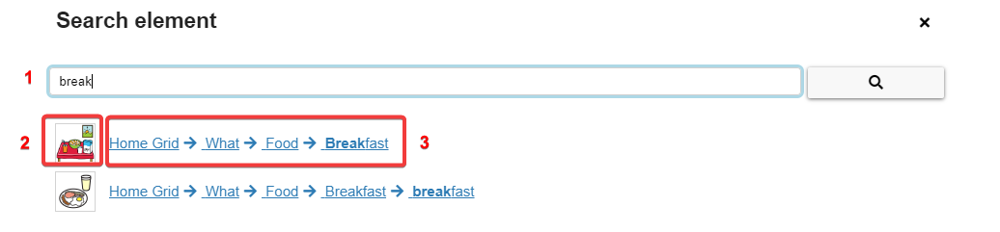

# Navigation Overview

[Back to Overview](README.md)

Once a user has been created and some grid set has been imported, AsTeRICS Grid always opens the last used user in the "main view", which looks like Figure 1:

*Figure 1: Main view (desktop view on the left, mobile view on the right)*

The elements have this functionality:

1. Open or close the left navigation sidebar
2. **Main**: navigate to the main view (currently shown)
3. **Manage grids**: show all grids of the current user, add new ones or backup them to a file, manage the global grid. (See chapters [editing grid set](05_editing-grid-set) and [editing grid](06_editing-grid.md))
4. [**Manage Dictionaries**](10_dictionaries.md): show all saved dictionaries, edit them or add new empty ones or import existing dictionaries
5. [**Change User**](04_navigation-overview.md#change-user): switch between saved users or log in an existing online user
6. [**Add online user**](04_navigation-overview.md#add-online-user): register a new online user (synchronized across devices)
7. [**Add offline user**](04_navigation-overview.md#add-offline-user): add a new offline user (only for this device)
8. **Settings**: select between general settings like application language and user settings like grid content language, voice or colors. (See chapters [basic setup](03_basic_setup.md) and [editing grid set](05_editing-grid-set.md))
9. **About AsTeRICS Grid**: Show general information, links, contact address
10. **Help**: find the AsTeRICS Grid user manuel, the ARASAAC tutorial or video tutorials
11. [**Editing on**](04_navigation-overview.md#editing-on): edit the layout of the grid, add new elements, actions for grid elements
12. [**Input options**](09_input-options.md): Options about how to select grid elements (e.g. click, hover, scanning)
13. **Fullscreen**: hide the sidebar and the bar on the top, only showing the current grid 
14. **Lock**: lock the screen in order to prevent unintended input or changes beside using and navigating the grid 
15. **Grid**: demo grid consisting of some grid elements which are navigating to other grids if selected (possible for those which show the grey symbol in the upper right corner)
16. [**Search function**](04_navigation-overview.md#search-function) (not shown in the Figure): Search for elements in the grid set. You can also use `Ctrl + F` on the keyboard.

## Search function
Clicking on "Search" in the main view or pressing `Ctrl + F` opens a search dialog. It can also be opened in fullscreen mode by an [element navigation action](08_actions.md#navigate-to-other-grid):

*Search dialog and search results*

These are the parts of the search dialog:
1. **search term**: text input field for the search term
2. **result image**: directly navigates to the selected element and highlights it. Keyboard shortcut for first search result: `[Enter]`
3. **result path**: navigates to the selected element step-by-step by highlighting the path beginning from the home grid. Keyboard shortcut for first search result: `[Ctrl + Enter]`

## Editing on

Clicking on Button "Editing on" (Figure 1.11) opens the edit view where a grid can be adapted, see Figure 2:

*Figure 2: Edit view (desktop view on the left, mobile view on the right)*

The following elements are available in the edit view:

1. Open or close the navigation sidebar
2. **Editing off**: navigate back to main view
3. **Undo**: reverts the last action
4. **Redo**: redoes the last action after reverting it
5. **More**: opens a menu with additional actions, e.g adding new elements
6. **Right-click on a grid element**: opens a menu for configuring this element (e.g. edit, delete, copy). On touchscreens open the menu with long tap on the element.

## Change User

In the "Change User" view it's possible to switch between users or login an existing online user (Figure 5):

*Figure 5: "Change user" view (desktop view on the left, mobile view on the right)*

The following elements are available in the change users view:

1. Open or close the navigation sidebar
2. **Active offline user**: the currently active user is recognizable by a black user symbol and the word "active" next to the username. The active user is the user whose grids and configuration are currently used and shown in all other views. 
3. **Inactive online user**: The little cloud symbol indicates an [online user](01_terms.md#user) and the gray user symbol that he is currently inactive, meaning that the user's grids are currently not used.
4. **Inactive offline user**: The gray user symbol without a cloud indicates an inactive [offline user](01_terms.md#user)
5. **Open**: sets the user "active" and opens the main view, showing the user's grid(s). Sets all other users inactive, there is always only one active user.
6. **Delete**: deletes the user and all of his grids and configuration. Use with caution, this action cannot be undone. This option is only available for offline users.
7. **Logout**: deletes the user and all of his grids and configuration, but only on the current device. Data in the cloud and on other devices that are logged in with the same user will not be deleted. This option is only available for online users.
8. **Login with other user**: put in username and password of an existing online user in order to add it to the current device. In order to create a new online or offline user, follow one of the links below.
9. **Remember checkbox**: if checked, the newly logged in online user will be saved to the device and listed in the list of users in the current user view. If unchecked the user will only be opened temporarily and no user data will be saved on the device (recommended for logging in on foreign devices).

## Add online user

In view "add online user" it's possible to register a new online user, Figure 6:

*Figure 6: Add online user view - register*

### Synchronization states

Online users can have the following synchronization states which are shown at the bottom of the navigation bar:

 **Synchronizing**: configuration is currently synchronizing with the cloud

 **Synchronized**: configuration is up-to-date with the cloud storage

 **Synchronization failed**: synchronization not possible, no internet connection

 **Synchronization paused**: synchronization paused for a short time and will be resumed shortly

 **Online only**: user is logged in online-only, meaning that configuration is not saved on the current device. Changes still will be saved in the cloud and therefore also be synchronized to other devices where this user is logged in. Users will be logged in online-only if the "remember checkbox" is unchecked when logging in (see [change user view](02_navigation.md#change-user---view)).

## Add offline user

In view "add offline user" it's possible to add a new [offline user](01_terms.md#user), Figure 7:

*Figure 7: Add offline user view*

## Shortcuts

Note that for macOs `⌘` (command key) can be used instead of `Ctrl`.

These are the global keyboard shortcuts available in AsTeRICS Grid:
* `Ctrl + Alt + Arrow Right`: change to the next stored user
* `Ctrl + Backspace`: navigate to the last grid
* `Ctrl + Pos1`: navigate to the main/home grid
* `Ctrl + F`: open dialog for searching elements

### Shortcuts in user mode
The shortcuts available in user mode (normal grid view) are listed below.

* `Ctrl + C`: copy current sentence from collection element to clipboard (as image).

### Shortcuts in edit mode
The shortcuts available in edit mode are listed below.

- `Ctrl + left mouse clicks`: select multiple elements, one after the other
- `Shift + left mouse clicks`: select multiple connected elements
- `Escape`: unselect all elements
- `Ctrl + E`: edit selected element
- `Ctrl + C`: copy selected elements to clipboard
- `Ctrl + X`: cut selected elements (copy to clipboard and delete from current grid)
- `Ctrl + V`: paste elements from clipboard. Elements are pasted at the location of the last interaction (you can click/tap to a free space before pasting). If multiple pasted elements aren't fitting at the current location, they are pasted below the existing elements.
- `Ctrl + A`: selects all elements
- `Ctrl + D`: duplicates selected elements
- `Ctrl + H`: hide / unhide selected elements
- `Ctrl + I`: create a new element
- `Ctrl + Shift + I`: create many new elements
- `Delete`: deletes selected elements
- `Ctrl + Z`: Undo
- `Ctrl + Shift + Z`: Redo

#### Layout shortcuts
- `Ctrl + ArrowUp`: move all elements up
- `Ctrl + ArrowRight`: move all elements right
- `Ctrl + ArrowDown`: move all elements down
- `Ctrl + ArrowLeft`: move all elements left

#### Transfer properties
- `Ctrl + Shift + A`: directly transfer all properties of selected element (`A` like all)
- `Ctrl + Shift + C`: directly transfer appearance properties of selected element (`C` like color)
- `Ctrl + Shift + P`: transfer custom properties of selected element (`P` like properties)
- `Escape`: cancel property transfer mode
- `Enter`: apply property transfer to selected elements

[Back to Overview](README.md)