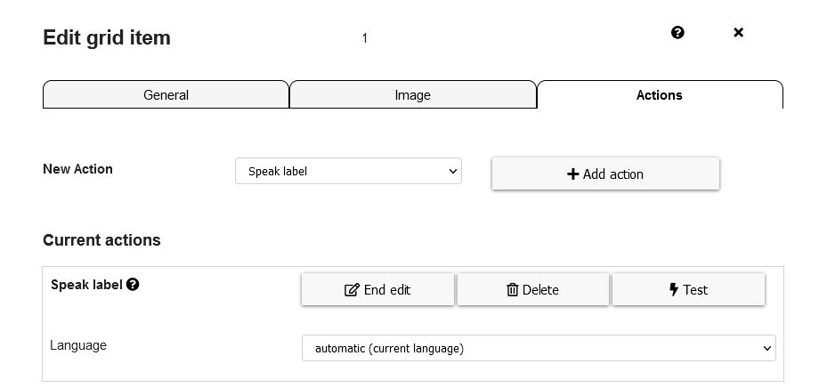
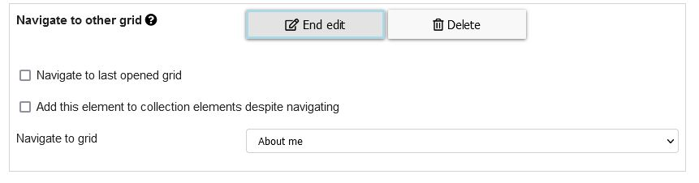
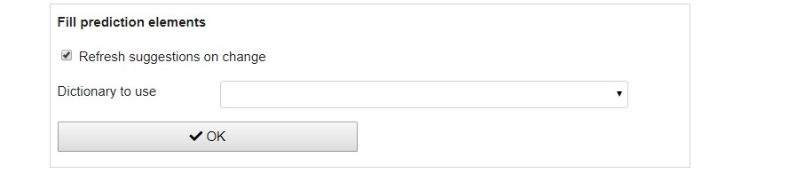
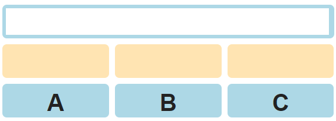
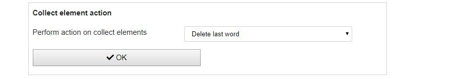
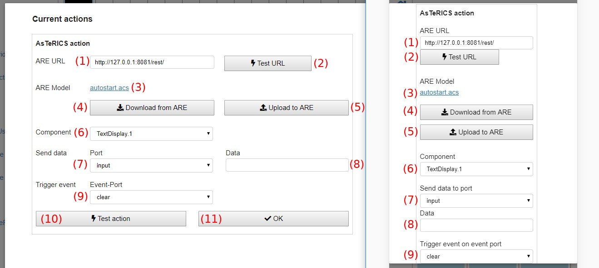
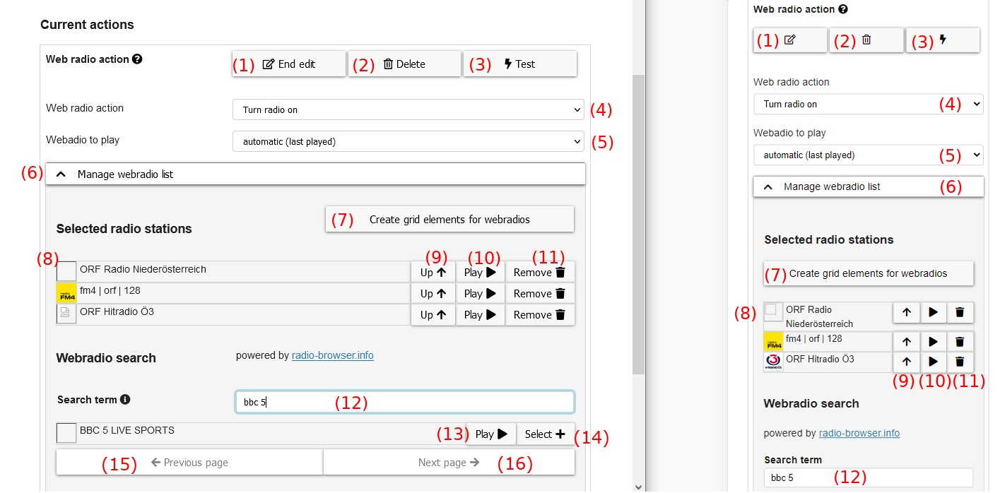

# Grid element actions
**Video on YouTube:** [Edit actions](https://www.youtube.com/watch?v=GAhtjs8bts0&list=PL0UXHkT03dGrIHldlEKR0ZWfNMkShuTNz&index=14&t=0s) (German, but auto-translated subtitles available)

This chapter is about actions that can be performed if a grid element is selected and how to configure them:

1. [Edit actions modal](05_actions.md#edit-actions-modal)
1. [Action Types](05_actions.md#speak-label)
    * [Speak label](05_actions.md#speak-label)
    * [Navigate to other grid](05_actions.md#navigate-to-other-grid)
    * [Speak custom text](05_actions.md#speak-custom-text)
    * [Fill prediction elements](05_actions.md#fill-prediction-elements)
    * [Collect element action](05_actions.md#collect-element-action)
    * [AsTeRICS Action](05_actions.md#asterics-action)
    * [Web radio action](05_actions.md#web-radio-action)

[Back to Overview](README.md)

## Edit actions modal

Choosing "Actions" in the [Edit grid element menu](03_appearance_layout.md#editing-grid-elements) opens a configuration modal (Fig. 1):

*Fig. 1: Edit actions modal*

This modal configures the actions that will be performed if the grid element is selected. These are the elements in the action modal:

1. **New action**: adds a new action to the grid, in the combobox the action type has to be selected
1. **Current actions**: list of currently configured actions that will be performed if the grid element is selected
1. **Speak label**: first configured action of this element - speak the label of the element
1. **Edit**: edit and configure the particular action
1. **Delete**: delete the action from this grid element
1. **Test**: tests the action, e.g. speaks the label. This button is not available for all types of actions.
1. **Cancel**: discard any changes and close the modal
1. **OK**: save all changes and close the modal
1. **OK, edit previous**: save all changes and edit the actions of the previous element
1. **OK, edit next**: save all changes and edit the actions of the next element

## Action types

These are the types of actions that are selectable (Fig. 1, number 1):

1. **Speak label**: speaks the label of the element using a computer voice (text-to-speech)
1. **Navigate to other grid**: navigates to another grid
1. **Speak custom text**: speaks a customizeable text using a computer voice (text-to-speech)
1. **Fill prediction elements**: fills all [prediction elements](01_terms.md#grid-element) in the current grid with word suggestions
1. **Collect element action**: performs actions on [collect elements](01_terms.md#grid-element) in the current grid, e.g. clearing it or copying it's text to clipboard
1. **AsTeRICS Action**: do an action in a running [model](01_terms.md#asterics-model) in the [AsTeRICS Framework](01_terms.md#asterics-framework)

### Speak label
Clicking on "Edit" on a "speak label" action (or creating a new one) shows the following configuration possibilities:

By default the language of the browser/system is selected. Available languages can differ depending on the browser, from experience [Google Chrome](https://www.google.com/chrome/) offers most languages. Clicking on the "Test" button speaks the label in the selected language.

*Note: some browsers like Internet Explorer do not support text-to-speech. In these browsers speak actions will do nothing.*

### Navigate to other grid
Clicking on "Edit" on a "navigate to other grid" action (or creating a new one) shows the following configuration possibilities:

"Grid to navigate" selects the grid to switch to if this action is performed. The combobox contains a list of the names of all available grids of the current user.

### Speak custom text
Clicking on "Edit" on a "speak custom text" action (or creating a new one) shows the following configuration possibilities:

For language selection the same conditions as for [speak label](05_actions.md#speak-label) actions apply. "Text to speak" is the custom text that should be spoken. The button "Test" tests the configuration and speaks the current text.

### Fill prediction elements
**Video on YouTube:** [Prediction elements](https://www.youtube.com/watch?v=t0FWZcM9TMg&list=PL0UXHkT03dGrIHldlEKR0ZWfNMkShuTNz&index=22&t=0s) (German, but auto-translated subtitles available)

The action "fill prediction elements" fills all [prediction elements](01_terms.md#grid-element) in the grid with word suggestions. Suggestions are calculated on the basis of the label of the current element, so an "fill prediction elements" action of an element with label "A" will fill the prediction elements with the most common words starting with character "A":

Clicking on "Edit" on a "fill prediction elements" action (or creating a new one) shows the following configuration possibilities:

The meaning of the options is:
1. **Refresh suggestions on change** (only available on [collect elements](01_terms.md#grid-element)): if checked prediction elements are recalculated and refilled on every change of the collection element on base of the current value of the collection element: 

1. **Dictionary to use**: select the dictionary you want to use (see [manage dictionaries](02_navigation.md#manage-dictionaries-view)). If nothing selected words from all available dictionaries will be suggested.

### Collect element action
**Video on YouTube:** [Collect elements](https://www.youtube.com/watch?v=X6YrWJW2ZoM&list=PL0UXHkT03dGrIHldlEKR0ZWfNMkShuTNz&index=21&t=0s) (German, but auto-translated subtitles available)

Collect element actions are various actions that are related to [collect elements](01_terms.md#grid-element). 

Clicking on "Edit" on a "collect element action" action (or creating a new one) shows the following configuration possibilities:

The possible actions to chose are:

1. **Clear collect element** empties the collect element
1. **Delete last word** deletes the last word of the collection elements: 

1. **Delete last character**: 

1. **Copy text to clipboard**: copies the current text of the collect element to clipboard in order to be available for paste in other programs
1. **Append text to clipboard**: appends the current text of the collect element to clipboard making it possible to collect longer texts in the clipboard which can be used in another program afterwards
1. **Clear clipboard**: empties the clipboard

### AsTeRICS Action
**Video on YouTube:** [AsTeRICS actions](https://www.youtube.com/watch?v=geLtm07HRKc&list=PL0UXHkT03dGrIHldlEKR0ZWfNMkShuTNz&index=24&t=0s) (German, but auto-translated subtitles available)

An "AsTeRICS action" performs an action in a running [model](01_terms.md#asterics-model) in the [AsTeRICS Framework](01_terms.md#asterics-framework). This can be any action that is possible with the AsTeRICS Framework, e.g. controlling a TV or performing computer actions like opening a program.

Figure 2 shows how an AsTeRICS action that controls a TV is working in more detail:

*Fig. 2: AsTeRICS action concept, example of controlling a TV*

The following steps are shown in Figure 2:
1. A user selects a grid element with an associated AsTeRICS action. An [AsTeRICS model](01_terms.md#asterics-model) which can perform the desired action (e.g. controlling a TV) is saved within the current grid.
1. The AsTeRICS model is uploaded to a running instance of the AsTeRICS Framework (ARE) and afterwards started. The model contains so-called "plugins" which are elements capable of communicating with external hardware, e.g. attached to the computer or accessible via network. In the example the "IrTrans" plugin is capable of communicating with an IrTrans device, which is a replacement for infrared remotes.
1. After uploading and starting the model on the AsTeRICS Framework, data is sent to a plugin contained in the model. In Fig. 2 some data is sent to the "action" port of the IrTrans plugin.
1. Sending data to the plugin causes the AsTeRICS Framework to communicate with the external real "IrTrans" hardware. The action contains the needed information to perform the desired action, for instance sending a "Volume down" command to a TV.
1. Finally the IrTrans device sends the infrared signal to the TV causing it to reduce the volume.

Clicking on "Edit" on a "AsTeRICS action" action (or creating a new one) shows the following configuration possibilities:

These are the possibilities while configuring an AsTeRICS Action:

1. **ARE URL**: the URL of a running ARE (AsTeRICS Framework) to connect with. Standard URL is `http://127.0.0.1:8081/rest/` for a locally running ARE.
1. **Test URL**: click in order to test the current URL. A tick (&#10003;) or times (&times;) symbol will indicate if the test was successful or has failed.
1. **ARE Model**: if there is already a [model](01_terms.md#asterics-model) of this action defined, the name of it is shown here. A click on the link downloads the model.
1. **Download from ARE**: downloads the currently running model from a running AsTeRICS Framework (ARE) instance and saves it to the grid. The current ARE model is replaced by this action.
1. **Upload to ARE**: uploads the saved model to a running AsTeRICS Framework (ARE) for testing purpose or in order to adapt it.
1. **Component**: selection of the component (plugin) of the selected model that should be used
1. **Send data**: define data that should be sent to a specific port of the component
1. **Trigger event**: selects an event that should be triggered on the selected component (optional, either "send data", "trigger event" or both can be used)
1. **Test action**: performs the defined AsTeRICS action for testing, same as will be later performed if the grid element is selected
1. **OK**: apply changes and close edit mode of this AsTeRICS action 

### Web radio action
**Video on YouTube:** [Web radio](https://www.youtube.com/watch?v=dKZwan9dZV4&list=PL0UXHkT03dGrIHldlEKR0ZWfNMkShuTNz&index=23&t=0s) (German, but auto-translated subtitles available)

AsTeRICS Grid is capable of searching and playing web radio stations. The station search capabilities are powered by the API of <a href="https://www.radio-browser.info/gui/#!/" target="_blank">radio-browser.info</a>.

Clicking on "Edit" on a "Web radio action" (or creating a new one) shows the following configuration possibilities:

These are the elements in this configuration dialog:

1. **Web radio action**: chooses the type of web radio action to perform which can be one of the following:
    * *Turn radio on*: turns on the radio with the channel selected at *Webradio to play*
    * *Turn radio on/off*: toggles the radio on/off state with the channel selected at *Webradio to play*
    * *Turn radio off*: turns the radio off
    * *Next radio channel*: moves to next radio channel in the list of selected radio stations, see (4)
    * *Previous radio channel*: moves to previous radio channel in the list of selected radio stations, see (4)
    * *Radio volume up*: increases the radio volume
    * *Radio volume down*: decreases the radio volume
1. **Webradio to play**: chooses which radio to play (only visible for *Turn radio on* and *Turn radio on/off*), possible channels to select are defined in selected radio stations list, see (4)
1. **Manage webradio list**: accordion which folds/unfolds the section where radio stations can be searched and selected
1. **Selected radio stations list**: list of selected radio stations which are available within the current grid
1. **Up**: moves the station up in the list (reordering)
1. **Play**: plays the radio channel
1. **Remove**: removes the radio channel from the list of selected radio stations
1. **Search term input**: search bar for searching new radio stations. By default search is done for radio station name, but the following additional properties are possible (see [API documentation](http://www.radio-browser.info/webservice#Advanced_station_search)): *name (default), country, state, language, tag, tagList, order*. To use this additional properties they have to be added with semicolon to the search term.
    * *Examples*: The search term for looking for austrian radio stations with name `Hitradio` would be: `name:Hitradio country:austria`. If the search term is just `Hitradio` search will be done for radio stations with this name.
1. **Webradio search result list**: result list for the current search term
1. **Play**: plays the radio station
1. **Select**: adds the radio station to the list of selected radio stations, see (4)
1. **Previous page**: navigates to the previous page of search results (if available)
1. **Next page**: navigates to the next page of search results (if available)

[&#x2190; Previous Chapter](04_input_options.md) [Next Chapter &#x2192;](06_users.md)

[Back to Overview](README.md)