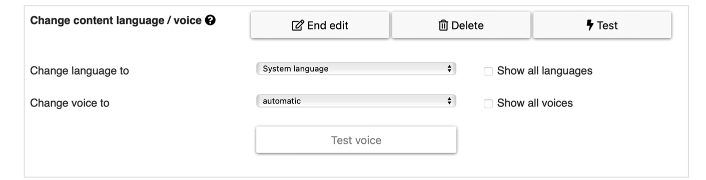
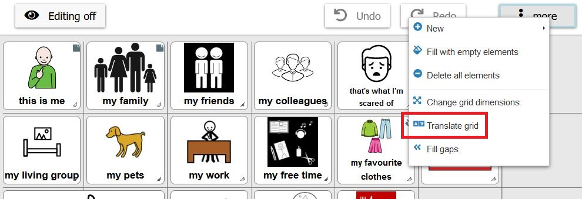
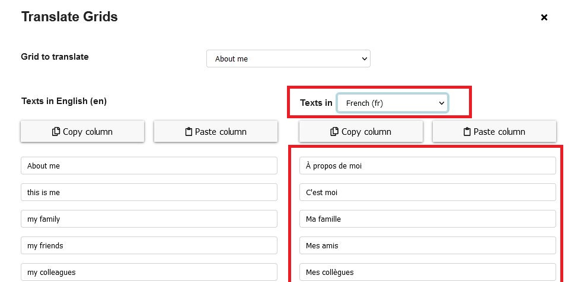
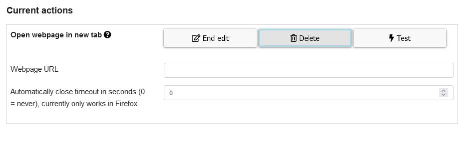
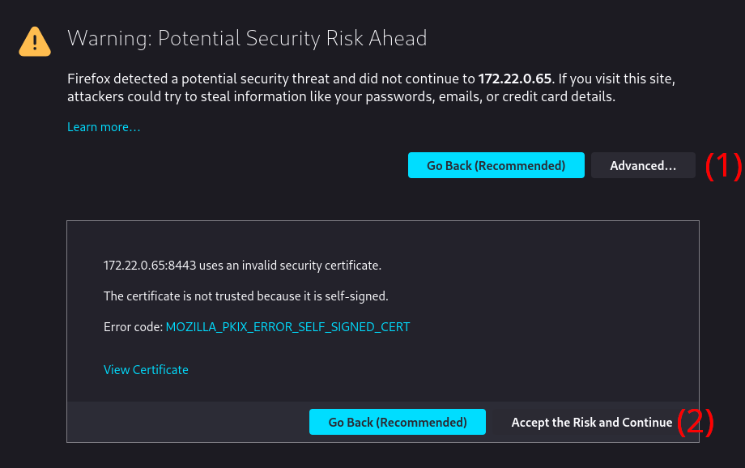

# Grid element actions

**Video on YouTube:** [Edit actions](https://www.youtube.com/watch?v=GAhtjs8bts0&list=PL0UXHkT03dGrIHldlEKR0ZWfNMkShuTNz&index=14&t=0s) (German, but auto-translated subtitles available)

This chapter is about actions that can be performed if a grid element is selected and how to configure them:

1. [Edit actions modal](05_actions.md#edit-actions-modal)
2. [Action Types](05_actions.md#action-types)
   * [Speak label](05_actions.md#speak-label)
   * [Navigate to other grid](05_actions.md#navigate-to-other-grid)
   * [Speak custom text](05_actions.md#speak-custom-text)
   * [Play recorded audio](05_actions.md#play-recorded-audio)
   * [Fill prediction elements](05_actions.md#fill-prediction-elements)
   * [Collect element action](05_actions.md#collect-element-action)
   * [AsTeRICS Action](05_actions.md#asterics-action)
   * [Web radio action](05_actions.md#web-radio-action)
   * [YouTube Action](05_actions.md#YouTube-Action)
   * [Change Content Language](05_actions.md#Change-Content-Language)
   * [Open webpage in new tab](05_actions.md#Open-webpage-in-new-tab)
   * [openHAB Action](05_actions.md#openhab-action)

[Back to Overview](README.md)

## Edit actions modal

*Fig. 1: Grid element menu*

Choosing "Edit" in the [Edit grid element menu](03_appearance_layout.md#editing-grid-elements) (Fig.1) and clicking on the *Actions* Tab opens the following configuration modal (Fig. 2):

*Fig. 2: Edit Actions modal*

This modal configures the actions that will be performed if the grid element is selected. These are the elements in the action modal:

1. **New action**: select a new action to the grid, in the combobox the action type has to be selected
2. **Add action**: adds the selected action type as a new action to the grid
3. **Current actions**: list of currently configured actions that will be performed if the grid element is selected
4. **Edit**: edit and configure the particular action
5. **Delete**: delete the action from this grid element
6. **Test**: tests the action, e.g. speaks the label. This button is not available for all types of actions.
7. **Cancel**: discard any changes and close the modal
8. **OK**: save all changes and close the modal
9. **OK, edit previous**: save all changes and edit the actions of the previous element
10. **OK, edit next**: save all changes and edit the actions of the next element

## Action types

These are the types of actions that are selectable (Fig. 2, number 1):
* **Speak label**: speaks the label of the element using a computer voice (text-to-speech)
* **Navigate to other grid**: navigates to another grid
* **Speak custom text**: speaks a customizeable text using a computer voice (text-to-speech)
* **Play recorded audio**: plays custom audio, previously recorded via the microphone of the device
* **Fill prediction elements**: fills all [prediction elements](01_terms.md#grid-element) in the current grid with word suggestions
* **Collect element action**: performs actions on [collect elements](01_terms.md#grid-element) in the current grid, e.g. clearing it or copying it's text to clipboard
* **AsTeRICS Action**: does an action in a running [model](01_terms.md#asterics-model) in the [AsTeRICS Framework](01_terms.md#asterics-framework)
* **Web radio action**: plays a web radio station
* **YouTube action**: links to a YouTube video and shows it without leaving the communicator
* **Change content language**: changes the content language (description of grid elements / language of the communicator grid(s))
* **Open web page in new tab**: allows to assign an external web page to a cell and opens it in a new tab

### Speak label

Clicking on "Edit" of a "speak label" action (or creating a new one by clicking on *Add action*) shows the following configuration possibilities (Fig. 3):

*Fig. 3: Configuration possibilites of "Speak label"*

By default the language of the browser/system is selected. Available languages can differ depending on the browser, from experience [Google Chrome](https://www.google.com/chrome/) offers most languages. Clicking on the "Test" button speaks the label in the selected language.

You can change the language and voice settings in the **Settings** menu.

*Note: Some browsers like Internet Explorer (old default Windows browser) do not support text-to-speech. In these browsers, speak actions will do nothing. In contrast, the Microsoft Edge browser (new default Windows browser) supports many text-to-speech voices.*

***Note: In case of problems when speaking the label (e.g. no spoken label or bad quality voice), check the [FAQ page](10_faq.html).***

### Navigate to other grid

Clicking on "Edit" of a "navigate to other grid" action (or creating a new one) shows the following configuration possibilities:

*Fig. 4: Configuration possibilites of "Navigate to other grid"*

- "Navigate to grid" allows you to select the grid to switch to if this action is performed. The combobox contains a list of the names of all available grids of the current user. 

- Alternatively the option "Navigate to last opened grid" can be activated.

- Additionally, the option "Add this element to collection elements" can be activated, in case it is necessary for this cell to appear in the accumulated phrase.

### Speak custom text

Clicking on "Edit" of a "speak custom text" action (or creating a new one) shows the following configuration possibilities:

*Fig. 5: Configuration possibilites of "Speak custom text"*

For language selection the same conditions as for [speak label](05_actions.md#speak-label) actions apply. "Text to speak" is the custom text that should be spoken. The button "Test" tests the configuration and speaks the current text.

### Play recorded audio

*Fig. 6: Configuration possibilities of action "Play recorded audio"*

After clicking **Record** for the first time, the browser will show a confirmation popup to ask if it's allowed to access the microphone. After confirmation the record starts and can be stopped by clicking on the same button again.

With the button **Play** an existing recording can be played.

**Notes**:
* an existing action containing recorded audio has priority over actions *Speak label* and *Speak custom text*. So if an action with recorded audio is present, these types of actions won't be performed.
* if items are collected in collect elements, recorded audio is only played for collect element actions in mode "speak separately", see [Collect element action](05_actions.md#collect-element-action).

### Fill prediction elements

**Video on YouTube:** [Prediction elements](https://www.youtube.com/watch?v=t0FWZcM9TMg&list=PL0UXHkT03dGrIHldlEKR0ZWfNMkShuTNz&index=22&t=0s) (German, but auto-translated subtitles available)

The action "fill prediction elements" fills all [prediction elements](01_terms.md#grid-element) in the grid with word suggestions. Suggestions are calculated on the basis of the label of the current element, so an "fill prediction elements" action of an element with label "A" will fill the prediction elements with the most common words starting with character "A":

Clicking on "Edit" on a "fill prediction elements" action (or creating a new one) shows the following configuration possibilities:

*Fig. 7: Configuration possibilites of "Fill prediction elements"*

**Dictionary to use**: select the dictionary you want to use (see [manage dictionaries](02_navigation.md#manage-dictionaries---view)). If nothing selected words from all available dictionaries will be suggested.

### Collect element action

**Video on YouTube:** [Collect elements](https://www.youtube.com/watch?v=X6YrWJW2ZoM&list=PL0UXHkT03dGrIHldlEKR0ZWfNMkShuTNz&index=21&t=0s) (German, but auto-translated subtitles available)

Collect element actions are various actions that are related to [collect elements](01_terms.md#grid-element). 

Clicking on "Edit" of a "collect element action" action (or creating a new one) shows the following configuration possibilities:

*Fig. 8: Configuration possibilites of "Collect element action"*

The possible actions to choose are (when opening the combo box):

1. **Speak collect element content (separately)**: speaks out the content of the collect element, where each collected element is spoken one by one, highlighting the currently spoken element.
1. **Speak collect element content (continuously)**: speaks out the content of the collect element as continuous text, not highlighting the currently spoken element.
2. **Speak collect element content (separately) and clear afterwards**: see above, clears collect element content after speaking
2. **Speak collect element content (continuously) and clear afterwards**: see above, clears collect element content after speaking
3. **Clear collect element** empties the collect element
4. **Delete last word/image** deletes the last word/image of the collection elements: 

5. **Delete last character**: 

6. **Copy text to clipboard**: copies the current text of the collect element to clipboard in order to be available for paste in other programs
7. **Append text to clipboard**: appends the current text of the collect element to clipboard making it possible to collect longer texts in the clipboard which can be used in another program afterwards
8. **Clear clipboard**: empties the clipboard
9. **Search text on YouTube**: searches the currently collected text on YouTube and loads the first video of the result in a YouTube player element. The YouTube player element can be located within the current grid or within another one to which is concurrently navigated to. 

### AsTeRICS Action

**Video on YouTube:** [AsTeRICS actions](https://www.youtube.com/watch?v=geLtm07HRKc&list=PL0UXHkT03dGrIHldlEKR0ZWfNMkShuTNz&index=24&t=0s) (German, but auto-translated subtitles available)

An "AsTeRICS action" performs an action in a running [model](01_terms.md#asterics-model) in the [AsTeRICS Framework](01_terms.md#asterics-framework). This can be any action that is possible with the AsTeRICS Framework, e.g. controlling a TV or performing computer actions like opening a program.

Figure 8 shows how an AsTeRICS action that controls a TV is working in more detail:

*Fig. 9: AsTeRICS action concept, example of controlling a TV*

The following steps are shown in Figure 8:

1. A user selects a grid element with an associated AsTeRICS action. An [AsTeRICS model](01_terms.md#asterics-model) which can perform the desired action (e.g. controlling a TV) is saved within the current grid.
2. The AsTeRICS model is uploaded to a running instance of the AsTeRICS Framework (ARE) and afterwards started. The model contains so-called "plugins" which are elements capable of communicating with external hardware, e.g. attached to the computer or accessible via network. In the example the "IrTrans" plugin is capable of communicating with an IrTrans device, which is a replacement for infrared remotes.
3. After uploading and starting the model on the AsTeRICS Framework, data is sent to a plugin contained in the model. In Fig. 9 some data is sent to the "action" port of the IrTrans plugin.
4. Sending data to the plugin causes the AsTeRICS Framework to communicate with the external real "IrTrans" hardware. The action contains the needed information to perform the desired action, for instance sending a "Volume down" command to a TV.
5. Finally the IrTrans device sends the infrared signal to the TV causing it to reduce the volume.

Clicking on "Edit" on a "AsTeRICS action" action (or creating a new one) shows the following configuration possibilities:

*Fig. 10: Configuration possibilites of "AsTeRICS action"*

These are the possibilities while configuring an AsTeRICS action:

1. **ARE URL**: the URL of a running ARE (AsTeRICS Framework) to connect with. Standard URL is `http://127.0.0.1:8081/rest/` for a locally running ARE.
2. **Test URL**: click in order to test the current URL. A tick (&#10003;) or times (&times;) symbol will indicate if the test was successful or has failed.
3. **ARE Model**: if there is already a [model](01_terms.md#asterics-model) of this action defined, the name of it is shown here. A click on the link downloads the model.
4. **Download from ARE**: downloads the currently running model from a running AsTeRICS Framework (ARE) instance and saves it to the grid. The current ARE model is replaced by this action.
5. **Upload to ARE**: uploads the saved model to a running AsTeRICS Framework (ARE) for testing purpose or in order to adapt it.
6. **Component**: selection of the component (plugin) of the selected model that should be used
7. **Send data to port**: define port the data should be sent
8. **Data**: define data that should be sent to the port determined above (number 7)
9. **Event-Port**: define the event that should be triggered (optional)
10. **Cancel**: discard any changes and close the modal
11. **OK**: save all changes and close the modal
12. **OK, edit previous**: save all changes and edit the actions of the previous element
13. **OK, edit next**: save all changes and edit the actions of the next element
14. **End edit**: apply changes and close edit mode of this AsTeRICS action
15. **Delete**: delete this action from this grid element
16. **Test**: performs the defined AsTeRICS action for testing, same as will be later performed if the grid element is selected

**Trigger event**: selects an event that should be triggered on the selected component (optional, either "send data", "trigger event" or both can be used)

### Web radio action

**Video on YouTube:** [Web radio](https://www.youtube.com/watch?v=dKZwan9dZV4&list=PL0UXHkT03dGrIHldlEKR0ZWfNMkShuTNz&index=23&t=0s) (German, but auto-translated subtitles available)

AsTeRICS Grid is capable of searching and playing web radio stations. The station search capabilities are powered by the API of <a href="https://www.radio-browser.info/gui/#!/" target="_blank">radio-browser.info</a>.

Clicking on "Edit" on a "Web radio action" (or creating a new one) shows the following configuration possibilities:

*Fig. 11: Configuration possibilites of "Web radio action"*

These are the elements in this configuration dialog:

1. **End edit**: apply changes and close edit mode of this Web radio action
2. **Delete**: delete this action from this grid element
3. **Test**: performs the defined Web radio action for testing, same as will be later performed if the grid element is selected
4. **Web radio action**: chooses the type of web radio action to perform which can be one of the following:
   * *Turn radio on*: turns on the radio with the channel selected at *Webradio to play*
   * *Turn radio on/off*: toggles the radio on/off state with the channel selected at *Webradio to play*
   * *Turn radio off*: turns the radio off
   * *Next radio channel*: moves to next radio channel in the list of selected radio stations, see (4)
   * *Previous radio channel*: moves to previous radio channel in the list of selected radio stations, see (4)
   * *Radio volume up*: increases the radio volume
   * *Radio volume down*: decreases the radio volume
5. **Webradio to play**: chooses which radio to play (only visible for *Turn radio on* and *Turn radio on/off*), possible channels to select are defined in selected radio stations list, see (4)
6. **Manage webradio list**: accordion which folds/unfolds the section where radio stations can be searched and selected
7. **Create grid elements for webradios**: As many radio stations selected, as many grid elements will be created, each element corresponding to one of the selected radio stations
8. **Selected radio stations list**: list of selected radio stations which are available within the current grid
9. **Up**: moves the station up in the list (reordering)
10. **Play**: plays the radio channel
11. **Remove**: removes the radio channel from the list of selected radio stations
12. **Search term input**: search bar for searching new radio stations. By default search is done for radio station name, but the following additional properties are possible (see [API documentation](http://www.radio-browser.info/webservice#Advanced_station_search)): *name (default), country, state, language, tag, tagList, order*. To use this additional properties they have to be added with semicolon to the search term. 
    * *Examples*: The search term for looking for austrian radio stations with name `Hitradio` would be: `name:Hitradio country:austria`. If the search term is just `Hitradio` search will be done for radio stations with this name.
13. **Webradio search result list**: result list for the current search term
14. **Play**: plays the radio station
15. **Select**: adds the radio station to the list of selected radio stations, see (8)
16. **Previous page**: navigates to the previous page of search results (if available)
17. **Next page**: navigates to the next page of search results (if available)

### YouTube Action

The YouTube Action allows you to link videos from this web page to the communicator and view them without leavting the communicator. Different control functions can be assigned to the cells for the display of the videos.

Clicking on "Edit" of a "YouTube" action (or creating a new one by clicking on *Add action*) shows the following configuration possibilities (Fig. 12):

*Fig. 12: Configuration possibilites of "YouTube Action"*

The possible actions/functions to choose are (when opening the combo box):

1. **Play video** 
   * Play type (Play single video, Play playlist, Play videos from search query, Play videos from channel)
   * Video link: insert the YouTube Video link here
   * Show video subtitles (if available): can be de/activated
   * Start video muted: can be de/activated
   * Perfrom action after navigation: can be de/activated
2. **Pause video**
3. **Play/Pause video**: same options like in *Play video*
4. **Restart video**: same options like in *Play video*
5. **Stop video**
6. **Step forward within video**
   * Step forward within video (seconds):  the number typed in represents the time in seconds the video will be fast-forwarded
7. **Step backward within video**
   * Step backward within video (seconds): the number typed in represents the time in seconds the video will be rewound
8. **Next video**
9. **Previous video**
10. **Show video in fullscreen**
11. **Video volume up**
    * Vido volume up (percent): the number typed in represents the percentage the volume will be volumed up
12. **Video volume down** 
    * Vido volume down (percent): the number typed in represents the percentage the volume will be volumed down
13. **Mute/unmute video**

To add a "YouTube Grid", one grid element hast to be a "YouTube Player", which can be created in the "Editing on view" in the menu "more" → 'New' → " New You Tube Player", as can be seen in Figure 12:

*Fig. 13: Creating a New YouTube Player element"*

Other ("normal") grid elements can be assigned with the functions listed above and a corresponding image can be chosen in the *Image Tab*. In ARASAAC, a collection of multimedia buttons is prepared, just type the word *button* in the *Image search* field of the *Image Tab*. If different grid elements are assigned with the *Play video* functions and are linked to different YouTube videos, the selected video will be played in the "YouTube Player" element, which has been created as shown in Figure 10.

### Change Content Language

This action is used to change the language of the communicator grid(s) by clicking on a grid element that we have configured to perform this action. 

Clicking on "Edit" of a "Change content language" action (or creating a new one by clicking on *Add action*) shows the following configuration possibilities (Fig. 14):

*Fig. 14: Configuration possibilites of "Change content language - Action"*

The language in which the application language shall be changed to can be selected in the corresponding combobox.

In the following two figures an example is show, where the content language can be switched from english to french or inversely by clicking on the corresponding flag (Fig. 15 and 16). 

*Fig. 15: Content language in English*

*Fig. 16: Content language in French*

First of all, you have to check if the grid content can already be translated in the desired language. To do that, you click on the "more" button in the "Edtiting on" view and select the *Translate grid* option as shown in Fig. 17:

*Fig. 17: Translate grid option*

After clicking on the "Translate grid" option, the following window opens (Fig. 18): 

*Fig. 18: Translate grid - select language and translate the content*

Here, the language, in which the grid content shall be translated, can be chosen. The right column shows the translations which are already stored in the application. Missing translations have to be filled in here.

### Open webpage in new tab

This action allows to assign an external web page to a grid element and, by clicking on it, to access the information contained therein.

Clicking on "Edit" of a "Open webpage in new tab" action (or creating a new one by clicking on *Add action*) shows the following configuration possibilities (Fig. 19):

*Fig. 19: Configuration possibilites of "Open webpage in new tab"*

* **Webpage URL**: copy the URL of the desired webpage and enter it here
* **Automatically close timeout in seconds**: enter time in seconds you want the tab remains open. After this time, the web page will close and the communicator grid will be displayed again

By clicking on the grid elemnt this action is assigned to, the chosen webpage is accessed and the user can navigate in it for the time which was set. After this time, the webpage will be closed and the user will return to the communicator. 

### openHAB Action

AsTeRICS Grid is capable of controlling a local openHAB installation through the browser. This action utilizes the REST
API of openHAB (see [openHAB API documentation](https://www.openhab.org/docs/configuration/restdocs.html)).

#### Accessing openHAB via http/https

By default, the actions searches for a local openHAB instance on port 8080.
If the openHAB installation is hosted in the local network, there are two possible ways to access it via the browser:

- **http**:
  If you are using openHAB over http with port 8080, you need to allow your browser to use ***mixed content***.
  Otherwise, the browser has no permission to access your local network.
- **https**:
  If you are using openHAB over https with port 8443, some browser need a one-time-exception to use the resources from
  the REST-API.
    - **Google Chrome**:
      Does not require additional steps for using the REST-API over https.
    - **Firefox and Safari**:
      In order to use the REST-API, a new tab with the address `https://<openHAB-IP-address>:8443/rest/items` must be
      opened. Firefox/Safari will prompt that this resource is insecure. By allowing to show the content of this website,
      an exception is created to allow general connections to the resource. After granting this exception, the
      openHAB-Action can access openHAB via https. Figure 20 shows an example of such a security prompt.

*Fig. 20: Example of a security prompt by Firefox*

Creating a new openHAB action shows the following configuration possibilities:

These are the elements in this configuration dialog:

1. **openHAB URL**: the URL of a running openHAB instance to connect with. Standard URL is `http://127.0.0.1:8080/rest/items/` for a local openHAB instance.
2. **Fetch Items**: click in order to fetch all available items from the current URL. A tick (&#10003;) or times (&times;) symbol will indicate if fetching was successful or has failed.
3. **Filter through item types**: filter fetched items with its item type (see [controllable Items](05_actions.md#controllable-items) for what items are controllable). By default, all items are selected. 
4. **Search for items by name**: search for items by name.
5. **Select item**: all or filtered items will be listed in a dropdown menu.
6. **Choose command to send**: according to the item type, a selection of commands will be available.
7. **Create grid elements**: this button allows to create grid elements for all actions of the currently selected items. Note that generated grid elements will only appear after clicking "OK" in the grid element edit modal. 
8. **Choose custom value for item (optional)**: some items (Dimmer, Color, Roller shutter, Temperature) can be controlled with custom values (e.g.: absolute value for dimmer, custom color). The input variant for the specific item will change accordingly.

When editing an already created action, selecting a new item will be disabled and only the action for the current command can be changed.
If the item should be changed, it is required to fetch the items again.
After the items are fetched, the action can be configured as if it was created new.

#### Controllable items

Following items are implemented and controllable via the action:

- **Switch**:
  Includes items like light switches, switches for automations, switches for outlets, ...
- **Dimmer**:
  Includes all dimmable lights
- **Roller shutter**:
  Includes all roller shutter and blinds
- **Color**:
  Includes all multicolor lights
- **Temperature**:
  Inlcudes items with a setable temperature like thermostats
- **Media player**:
  Includes all media player devices

An item must be implemented in openHAB in order to be accessible via the action.

#### Notes:

- In order to use this action, CORS must be enabled by your openHAB installation. Otherwise, openHAB will deny the
  action calls.
- You must be in the same network as your openHAB installation.
- Basic Authentication is not supported.

[&#x2190; Previous Chapter](04_input_options.md) [Next Chapter &#x2192;](06_users.md)

[Back to Overview](README.md)
