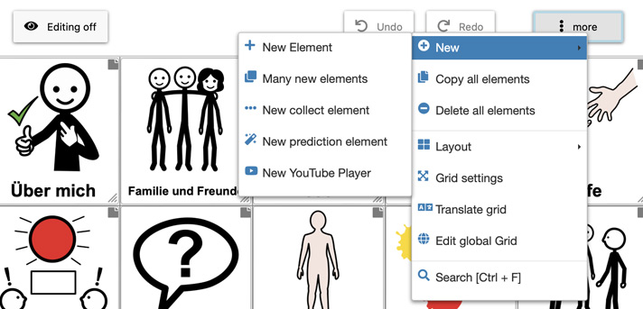

# Editing a Grid

This chapter explains how to adapt grids and explains special types of grids.

- [Edit View](06_editing-grid.md#edit-view)
- [Manage Grids View](06_editing-grid.md#manage-grids-view)
- [Global Grid](06_editing-grid.md#global-grid)
- [Home Grid](06_editing-grid.md#home-grid)

[Back to Overview](README.md)

Options for editing a grid are located under in the edit view (`Main -> Editing on`) and in the `Manage grids` view. 

## Edit View

In the edit view, the following menu opens on a click on `more`:

*Figure 1: Edit view - menu "more"*

The following actions for editing the grid are available:

- **Copy all elements**: copies all grid elements from the grid
- **Delete all elements**: removes all grid elements from the grid
- **Layout**:
   - Move all elements up/right/down/left
   - Normalize grid: set all grid elements to width and height `1` and move all elements to the top and left
- **Grid settings**: settings about the current grid
   - Grid size: number of rows and minimum number of columns of the current
   - Show global grid: activated by default, allows to deactivate the global grid for specific grids
- **Edit global Grid**: directly go to the edit page for the global grid, otherwise go to `Manage grids → Edit global Grid` (at the bottom)

**Reposition grid elements**: Grid elements can be repositioned by dragging them (drag & drop). Dropping above an existing element exchanges the places. Dropping it between two elements inserts it between these elements. 
On the right bottom corner it's possible to resize a grid element.

## Manage Grids View

The manage grids view provides an overview about the current grids of a user, see Figure 2:

*Figure 2: "Manage grids" - view (desktop view on the left, mobile view on the right)*

The following actions for editing the grid are available in the manage grids view:

2. **Name of grid**: type name of the grid and confirm by clicking on the tick
3. **New grid**: add a new, empty grid
4. **more**: shows menu with additional actions, e.g. backup the grids to file or restore backups from file
5. **Show**: open this grid in main view
6. **Edit**: open this grid in edit view
7. **Clone**: duplicate this grid, creating a copy of it with a different name
8. **Delete**: delete this grid
9. **Export**: saves and downloads this specific grid to a `.grd` file creating a backup of it (saves only this single grid, see "More" menu (Number 4) to backup all grids)
10. **Save as PDF**: saves and downloades the grid as PDF
11. **Grids to show**: select which grids shall be shown in the grid list
12. **Sort grids by**: select how the grids in the grid list shall be sorted

## Global Grid

The global grid is a grid containing elements that are shown on every page. So for displaying a grid in normal user mode (`Main`) the elements of the current grid and the global grid are combined and shown in a single grid. Figure 5 shows the default global grid in edit mode:

*Figure 5: Global Grid*

While editing the global grid it's possible to define its height by opening `More -> Grid settings` and setting the value for `Height of first global grid row`.

## Home Grid

At the bottom of the `Manage grids` view it's possible to define a `Home grid`. This grid is automatically opened at starting AsTeRICS Grid. If no home grid is defined, the last opened grid is opened.

`Navigate to home grid after selecting an element` can be selected in order to automatically navigate to the home grid after any element (which doesn't navigate to an other grid) is selected. This can speed up the construction of sentences in more complex communicator interfaces.

It's possible to define an action that navigates to the home grid, see action ["Navigate to other grid"](08_actions.md#navigate-to-other-grid).

[Back to Overview](README.md)