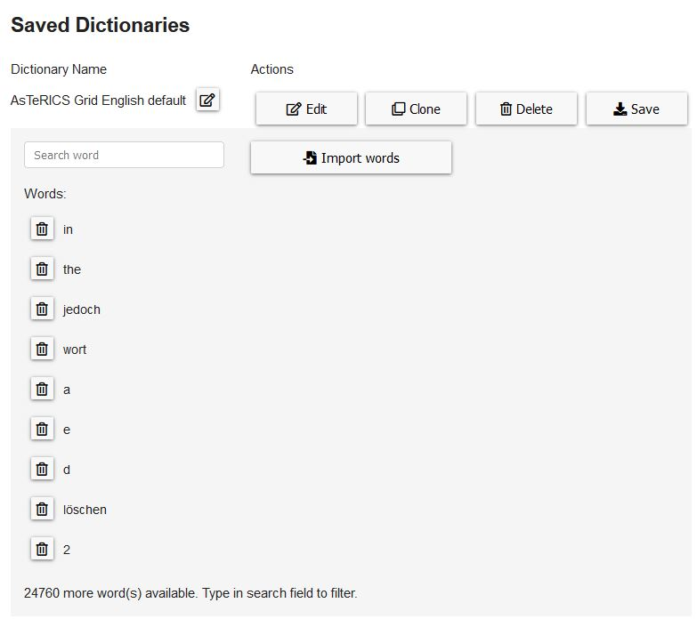
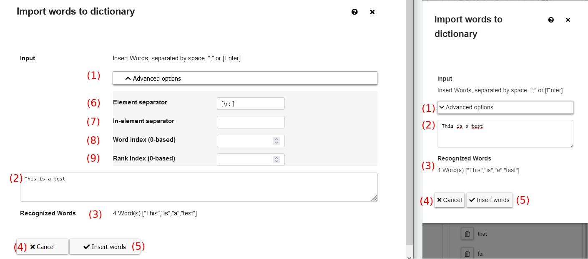

# Dictionaries
**Video on YouTube:** [Manage dictionaries](https://www.youtube.com/watch?v=DS9om8MDEDY&list=PL0UXHkT03dGrIHldlEKR0ZWfNMkShuTNz&index=19&t=0s) (German, but auto-translated subtitles available)

This chapter is about dictionaries and how to manage and use them within AsTeRICS Grid.

[Back to Overview](README.md)

A dictionary is a collection of words and their relations that is saved within AsTeRICS Grid in order to fill [prediction elements](01_terms.md#grid-element). 

## Edit dictionaries
The basic functionality of the manage dictionaries view was already described in chapter [navigation and basic functionality](02_navigation.md).

In the manage dictionaries view clicking on "Edit" in the list of dictionaries allows to see the details of a dictionary and editing it:


*Figure 1: Edit a dictionary*

Typing a word or a part of it in the search field filters the list of shown words. Clicking on the recycle bin symbol next to a word deletes it from the dictionary.


## Add words
Clicking on the "Import words" in Figure 1 button opens a modal:


*Figure 2: Import words modal*

These are the elements of the "import words" modal:

1. **Advanced options**: click to toggle visibility of advanced import options (Fig. 2, advanced options are shown on the left, hidden on the right)
1. **Input field**: field to input or paste words that should be imported to the dictionary 
1. **Recognized words**: live-updated list of recognized words based on the input options and words typed into the textfield 
1. **Cancel**: discard changes and close the modal 
1. **Insert words**: import the recognized words to the dictionary and close the modal 
1. **Element separator**: separator between words to recognize, can be either a single character or <a href="https://developer.mozilla.org/de/docs/Web/JavaScript/Reference/Global_Objects/RegExp" target="_blank">Javascript RegExp syntax</a>. Default value is the Javascript RegExp `[\n; ]` meaning that line breaks, semicolons and spaces can be used to divide words.
1. **In-element separator** (optional): single character or Javascript RegExp expression that re-splits elements that are recognized by "element separator". This is needed if the imported data consists of words and and a rank specifying the position of the word based on it's frequency.
1. **Word index**: if "in-element separator" is set this property specifies the position of the word 
1. **Rank index**: if "in-element separator" is set this property specifies the position of the rank 

### Example: import a big word list

This example shows how to import a big list of words, for instance a list of the <a href="http://corpus.leeds.ac.uk/frqc/internet-en-forms.num" target="_blank">most frequent 25000 words</a> from from <a href="http://corpus.leeds.ac.uk/" target="_blank">Corpus leeds</a>. 

The format of the list looks like this:
```
1 43116.72 the
2 25428.07 of
3 22833.85 to
...
```

Each data record has the format `<rank> <frequency> <word>` and is separated by a line separator `\n`. In order to import this list to AsTeRICS Grid the whole list has to be copied, inserted into the text field of the import modal (Fig. 2, number 2) and the following advanced options have to be set:

1. **Element separator**: `\n` - since the data records are separated by line breaks
1. **In-element separator**: `[ ]` (space) - since the data inside the lines is separated by spaces
1. **Word index**: `2` - since the word is the third element within a data record (zero-based index)
1. **Rank index**: `0` - since the rank is the first element within a data record (zero-based index)


[&#x2190; Previous Chapter](06_users.md)

[Back to Overview](README.md)


