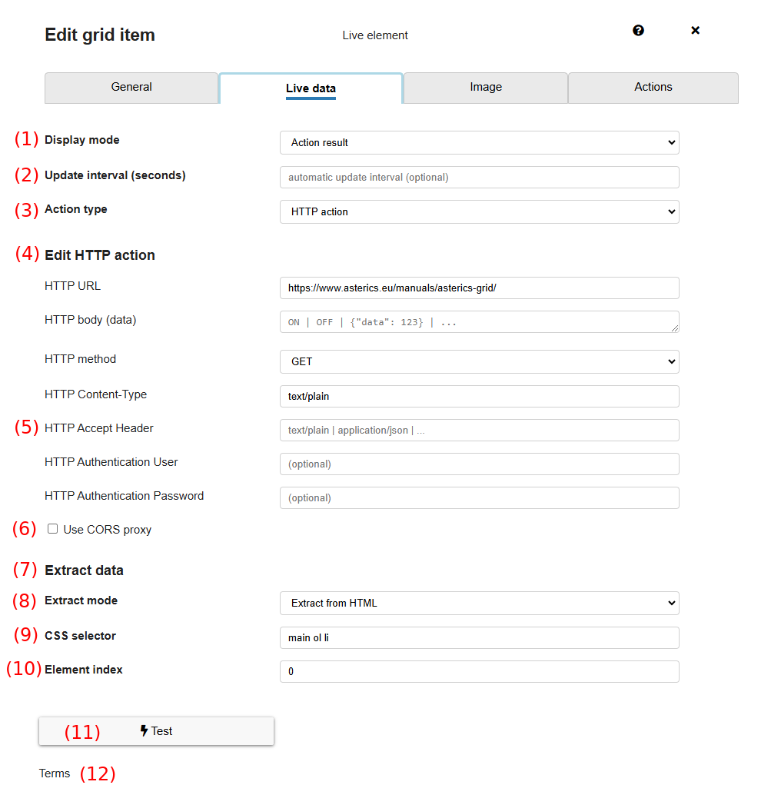
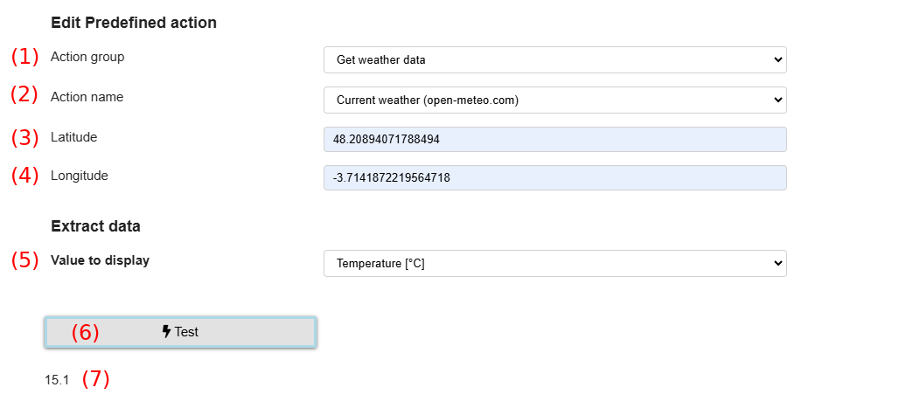

# Live elements in AsTeRICS Grid

Live elements can display dynamic information. This can be:
* **Application / system status**, e.g. current volume or battery level
* **Date and time** values
* **Random values**: e.g. dice 1-6
* **Status of devices**, e.g. smart devices like [Shelly plugs](https://www.shelly.com/de/products/shelly-plug-s-gen3)
* **Content of external websites**, e.g. current headlines from some news sites
* **Any other content retrieved by HTTP from any API**, e.g. random jokes or the current weather

Live elements can be created in the edit view like all other elements by selecting `New -> New live element`.
After creating a live element the tab `Live data` allows to specify which kind of data should be displayed:

*Fig.1: Tab "Live data" for configuring a live element*

This is how the live element can be configured, see Fig. 1:
* **(1) Display mode** allows the select the type of data to be displayed, can be:
   * **Date / time**, e.g. current time, date, weekday etc.
   * **Application state**, e.g. current volume, battery state
   * **Action result**, result of an action, e.g. HTTP action retrieving data from an API
   * **Random value**, choosing randomly from a set of values, e.g. dice
   * **Podcast state**, state of currently played podcast, see [Podcast actions]()
* **(2) Update interval**: the interval in seconds in which the value should be updated. Not applicable for "Date / time" and "application state", those are updated automatically.

## Action result - HTTP action
Figure 1 shows the configuration of a live element displaying the result of an HTTP action. It shows these possibilities for configuration:
* **(4) Edit HTTP action**: in this section the properties of the HTTP action can be configured, it has the same properties like an HTTP action defined in "Actions", see [documentation for HTTP action](./05_actions.md#http-action). It has two additional properties `HTTP Accept Header` and `Use CORS proxy`.
   * **(5) HTTP Accept Header**: can set the HTTP `Accept` header, since it's needed for some APIs in order to return the correct data format, e.g. `appliation/json`
   * **(6) Use CORS proxy**: if set, the request is directed through a proxy allowing to retrieve information from a website, which doesn't return [CORS headers](https://developer.mozilla.org/en-US/docs/Web/HTTP/CORS). Don't use it if you have any credentials or sensitive information within the request.
* **(7) Extract data**: in this section it's possible to define how data should be extracted from the result of the specified HTTP request
   * **(8) Extract mode**: specify the type of extraction that should be performed on the data. Possible values are:
      * **Extract from JSON**: extracts some information from a JSON response
      * **Extract from HTML**: extracts some information from an HTML response
   * **(9) Selector**: a selector defining which information to extract from the JSON or HTML response:
      * **JSON path**: defines which property of the JSON response should be extracted. For instance if the JSON looks like `{data: {"state": "ON", "temperature": 25}}` the "JSON path" could be `data.state` or `data.temperature` to extract and display the values `ON` or `25` from this JSON.
      * **CSS selector**: defines which parts of an HTML response should be extracted, see [docs on CSS selectors](https://developer.mozilla.org/en-US/docs/Web/CSS/CSS_selectors). For a website containing several `h1` headings in a `main` section, the selector could be `main h1` to select all these headings.
   * **(10) Element index**: only for "Extract from HTML". Defines which element of the parts selected by the "CSS selector" should be used, e.g. index `0` for the first element. If not specified, all elements are extracted and shown.
* **(11) Test**: tests the current configuration and shows the current result of the configuration below (12).

## Action result - Predefined action
If "Predefined action" is selected for "Action type", it's possible to select from a set of predefined actions (requests) making configuration easier for the user. All predefined actions and requests are defined in the GitHub repository [AsTeRICS-Grid-Boards](https://github.com/asterics/AsTeRICS-Grid-Boards/).

*Fig.2: Configuration for action type "Predefined action", example of getting weather data*

Figure 2 shows the configuration of a predefined action for displaying data by the example of retrieving weather data:
1. **Action group**: select the general group of actions to retrieve data, e.g. get weather data, get a joke or get data from a smart device.
2. **Action name**: select the specific action to perform, e.g. getting current weather data from a specific provider.
3. **Latitude**: a custom value which is defined by the current predefined action, in this case the latitude of the GPS coordinates where the current weather should be displayed. For other predefined actions these values change according to the currently selected action.
4. **Longitude**: the longitude of the GPS coordinates for retrieving the weather. GPS coordinates can be easily looked up e.g. at Google Maps by right-clicking at any point on the map.
5. **Value to display**: select from predefined values which can be extracted for the request done with the current predefined action. For retrieving weather data it's possible to select from weather-related data like temperature, wind speed, rain, etc.
6. **Test**: tests the current configuration and shows the current value below (7). In this example it's the current temperature at the given coordinates.

## Date / time
If "Date / time" is selected for display mode, it's possible to select from these formats to display date- and time-related data:
* **Date**: current date like `2/21/2025`
* **Date (long)**: current date with weekday and month name like `Friday, February 21, 2025` 
* **Time**: current time like `12:20 PM`
* **Time (long)**: current time including seconds like `12:20:30 PM`
* **Datetime**: current date and time like `2/21/2025, 12:20:30 PM`
* **Weekday**: current weekday, e.g. `Friday` 
* **Month**: current month, e.g. `February`

All formats are adapted according to the current content language, e.g. showing the date as `2/21/2025` for English and `21.2.2025` for German.

## Application state
If "Application state" is selected for display mode, it's possible to select from these values:
* **Global volume**: current global volume 
* **YouTube volume**: current YouTube volume 
* **Radio volume**: current webradio volume 
* **Battery level**: current battery level of the system. Note that this doesn't work on all systems and browsers, see [getBattery on caniuse.com](https://caniuse.com/mdn-api_navigator_getbattery).

## Random value
If "Random value" is selected for display mode, it's possible to specify these values:
* **Values to choose from**: a semicolon-separated list of values which are used for choosing. For instance `1;2;3;4;5;6` for a dice. Note that also emojis can be used by copying them from a page like [emojicopy.com](https://emojicopy.com/).
* **Update interval**: interval for automatic update of the element, meaning choosing a random value again. If not specified, there is no automatic update.

## Podcast state
If "Podcast state" is selected for display mode, the live element shows a state of the currently played podcast. It's possible to select from these states:
* **Current podcast title**: title of the currently played podcast
* **Current episode title**: title of the currently played episode
* **Playback time**: current playback time of the current episode
* **Remaining time**: remaining playback time of the current episode

## Update live elements manually
It's possible to update live elements manually as an element action that can be attached to any element. This makes sense for live elements containing random data or retrieving external information like jokes.

To set up the action to update all live elements manually, add a new `System action` and choose action type `Update live elements`. It's also possible to set a delay for updating, which makes sense for use-cases like toggling a smart switch, which needs some time to update the cloud value after toggling.

## Placeholders
Live elements can optionally have a label, like normal elements. There are two possibilities:
* **Normal labels**: by default the live value is appended to the label of the element. So if the label is `Current time:` for a live time element, the shown label will be something like `Current time: 12:20 PM`.
* **Placeholder**: it's possible to use the placeholder `{0}` which is replaced by the live value. So if the label is `{0} is the current time`, the shown label will be something like `12:20 PM is the current time`. Placeholders can also be used for custom speak texts.

All functionalities for live elements can be tried and tested in [this demo configuration for live elements](https://grid.asterics.eu/?gridset_filename=live-element-demos.grd.json).