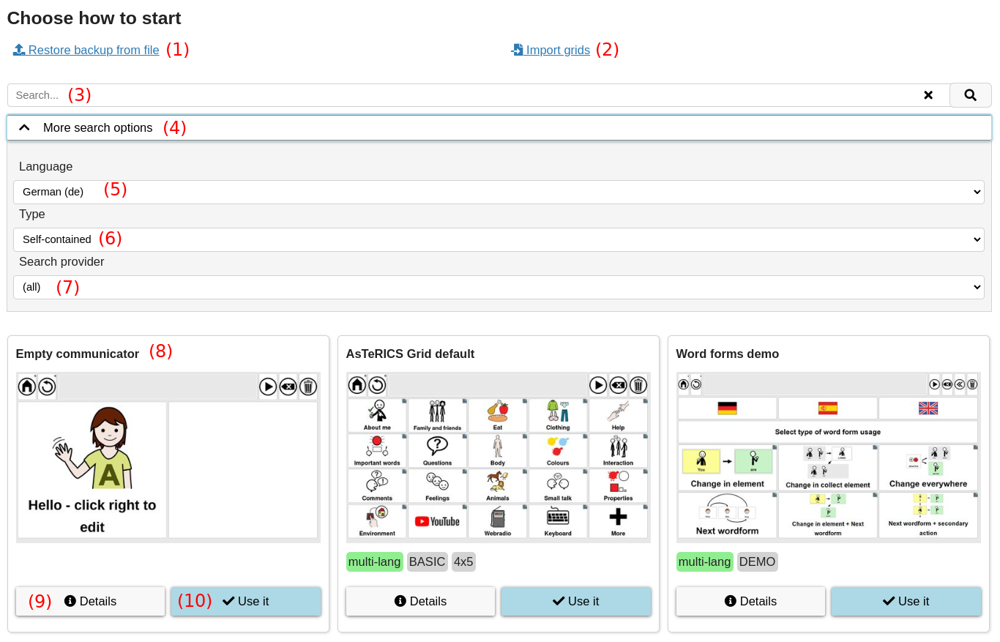
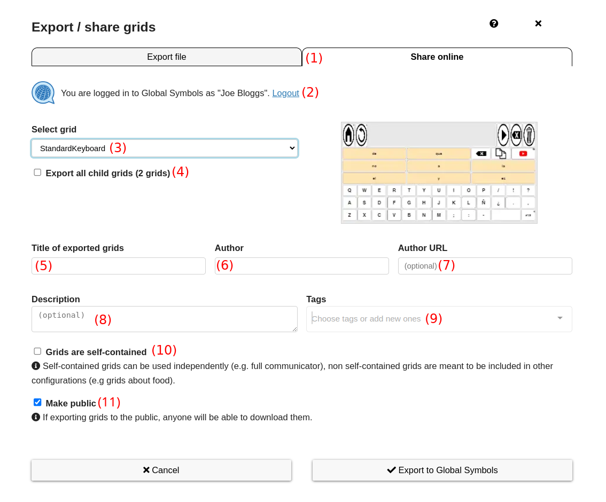
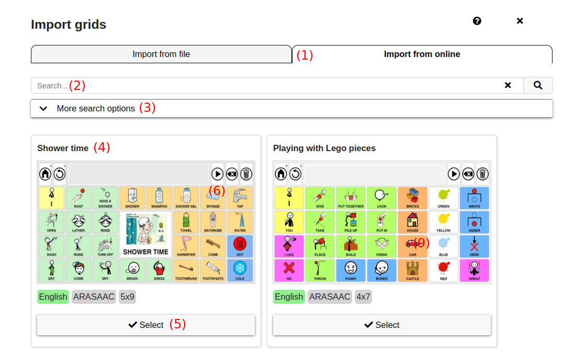
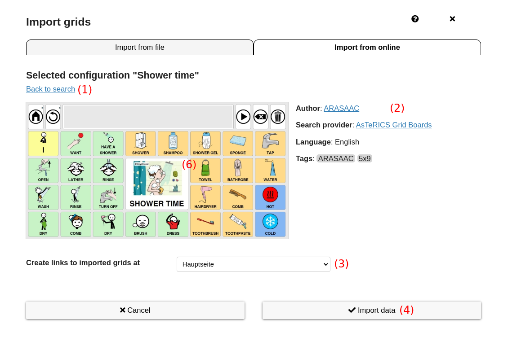

# Sharing and importing grids from external web-services

For sharing grids with others, there is the [possibility to do it via exported files](02_navigation.md#more-button---additional-options). However, as this is can be cumbersome, this document describes more comfortable ways and in general possibilities to import and export grids from external web-services.

## Terms
There are the following terms related to importing and exporting grids:
* **Grid set** or **Board set** or **configuration**: some grids which could be imported or exported. This could be a single grid, several related grids or a whole complex communicator.
* **self-contained** grids can be used independently (e.g. full communicator)
* **non-self-contained** or **single boards**: grids that are meant to be included in other configurations (e.g. grids about one specific topic).

## Import view
After creating a new user or deleting all grids, the import view is shown (Fig. 1).

*Fig.1: Import view showing possible configurations to import*

These are the parts of the import view:
1. **Restore backup from file**: opens a dialog in order to import a backup from file
1. **Import grids**: opens a dialog in order to import custom data from file or non-self-contained grid from an online source.
1. **Searchbar**: search for the name or tags of configurations
1. **More search options**: accordion to toggle visibility of additional search options
1. **Language**: the language for searching configurations
1. **Type**: the type for searching configurations (self-contained or single boards)
1. **Search provider**: select the external source for searching for configurations
1. **Results**: search results are shown as cards containing the title, a screenshot and tags of the configuration
1. **Details**: Button to show a popup with details about this configuration (e.g. Author, Description, etc.)
1. **Use it**: Button to import and use this configuration

## External web-services
Currently there are two external web-services for importing / exporting grids:
1. **AsTeRICS Grid Boards**: external GitHub repository containing all a collection of curated configurations, see [detailed info about AsTeRICS Grid Boards](https://github.com/asterics/AsTeRICS-Grid-Boards?tab=readme-ov-file#asterics-grid-boards).
1. **Global Symbols**: british organization providing a collection of open symbols sets and an app named Board Builder for creating grids (they name them board sets). See [more info about Global Symbols](https://globalsymbols.com/about?locale=en).

## Export configurations
Navigating to "Manage grids -> more -> Export / share grids" opens a dialog which can be used to export grids to file or to an external web-service (see Fig. 2).

*Fig.2: Dialog for exporting grids to external web-service*

The export dialog contains the following elements:
1. **Tabs**: two tabs "Export file" or "Share online" in order to choose where grids should be exported to
1. **Global Symbols login state**: area indicating the login state at Global Symbols. If not logged in, it's mandatory to login before being able to export something.
1. **Select grid**: select which grids should be exported. Either select a single grid or "All grids".
1. **Export all child grids**: if checked, all descendant child grids (so all grids connected to the selected grid) are exported. This makes sense in order to export a set of related grids (e.g. several grids about football).
1. **Title of exported grids**: choose an expressive name of the grids to export, e.g. "FIFA World Cup 2026 teams and players"
1. **Author**: name of the author of the exported grids
1. **Author URL**: optional URL that is related to the author or contains information about him / her or the organisation. 
1. **Description**: an optional longer description of the grids (up to 1000 characters)
1. **Tags**: optional tags describing the topic or properties of the grids, e.g. "SPORTS", "MEDICAL" or "4x6" (grid size). It's possible to add custom tags.
1. **Grids are self-contained**: check if the exported grids are self-contained and should be used independently, e.g. a full communicator
1. **Make public**: if checked, the exported grids will be publicly available for everyone. This is necessary if you want to share the grids using a link. Make sure that publicly shared grids aren't containing any personal information or pictures.

## Import configurations
Navigating to "Manage grids -> more -> Import grids" opens a dialog which can be used to import grids from file or from an external web-service (see Fig. 3 and 4).

*Fig.3: Dialog for importing grids from external web-service*

The import dialog contains the following elements:
1. **Tabs**: two tabs "Import from file" or "Import from online" in order to choose where grids should be imported from
1. **Search bar**: search for the name or tags of configurations to import
1. **More search options**: show options in order to define language and search provider for searching
1. **Results**: search results are shown as cards containing the title, a screenshot and tags of the configuration
1. **Select**: button which selects this configuration for import and shows details on the next view

*Fig.4: Second part of dialog for importing grids from external web-service, after selecting a configuration*

After selecting a configuration to import, these elements are shown:
1. **Back to search**: clicking on this link unselects the selected configuration and navigates back to search, where a different configuration can be selected
1. **Details**: area showing information about the configuration (Author, language, tags, etc.)
1. **Create links to imported grids at**: choose on which existing grid the imported grids should be linked
1. **Import data**: imports the selected configuration. For each set of connected grids from the imported configuration a new element is created in the chosen existing grid, which navigates to the set. Example: assume the imported grid set consists of 10 grids, 5 about football and 5 about food, where each of the 5 are connected to each other (e.g. 1st football grid links to 2nd football grid links 3rd football grid, ...). Then one element "Football" and one element "Food" is created at the existing target grid, linking to the 1st football grid and the 1st food grid.