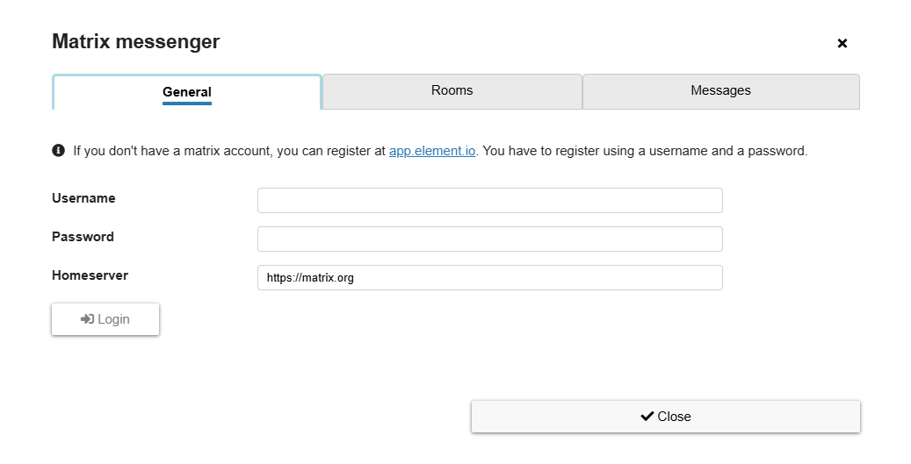
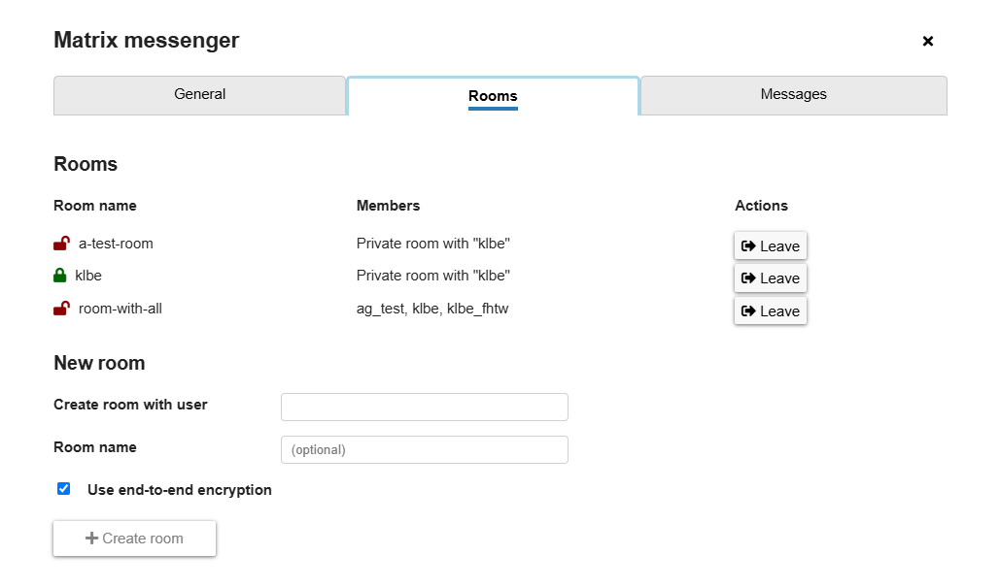

# Matrix messenger in AsTeRICS Grid

The integration of the Matrix protocol makes it possible to use AsTeRICS Grid as simple or complex messenger and connect to other people via chatting.

## Background info

Matrix is an open and decentralized messenger protocol. It's like email, where there are many email providers which can interact with each other (e.g. meaning that you can send mails from GMail to Yahoo Mail). Matrix is similar to email, but for messaging, so it's an open alternative to closed or centralized messengers like WhatsApp, Signal, Telegram or similar.

There are many clients for Matrix (similar to email apps) and providers using the Matrix protocol (similar to GMail, Yahoo mail, etc.). The name of the most used client app for Matrix is *Element* and it's available for different platforms, see [Download page of Element](https://element.io/download).

The most well known provider (like GMail for mails) is run by [matrix.org](https://matrix.org/), but there are many others, see [list of matrix providers](https://servers.joinmatrix.org/) or other lists. For advanced users it's also possible to [set up an own "homeserver"](https://matrix.org/ecosystem/servers/) and it's even possible to [connect it with well-known messengers](https://matrix.org/ecosystem/bridges/) like WhatsApp or Signal using bridges.

AsTeRICS Grid can be used as Matrix client, so it's possible to connect and chat with any other user in the Matrix world. It's also possible to chat with another user of AsTeRICS Grid.

## Getting started

Follow these steps in order to be able to use Matrix within AsTeRICS Grid:
* create an account on a Matrix server of your choice. The simplest is to use the web version: [Register using Element web](https://app.element.io/#/register).
* In AsTeRICS Grid go to `Settings -> Integrations -> Matrix messenger` and click on `Configure matrix messenger`. It opens a dialog where it's possible to log in using the credentials you registered with earlier.

## Settings

Clicking on `Configure matrix messenger` in `Settings -> Integrations -> Matrix messenger` opens a dialog (Fig. 1) with the following parts:
* **Tab General**: tab for logging in to a Matrix account (Figure 1)
* **Tab Rooms**: tab for configuring Matrix rooms of the logged-in account. Rooms are chats with one or more people.
* **Messages**: tab for seeing and writing messages to different rooms.

*Figure 1: Settings dialog for Matrix integration - tab "General"*

Tab "General" allows to log in:
* **Username**: the username you've used for registration at a Matrix provider
* **Password**: the password you've used for registration at a Matrix provider
* **Homeserver**: the provider, where you've registered, defaults to `matrix.org`

### Tab Rooms

In Matrix a Room is a chat with one or more persons. So it can be a private chat with another person or a group chat with many persons. The tab "Rooms" allows to see and configure them (Fig. 2):

*Figure 2: Settings dialog for Matrix integration - tab "Rooms"*

These are the contents of tab "Rooms":
* **Rooms**: a list of all rooms where the currently logged-in user is a member. Rooms can be left by clicking on the button `Leave`.
* **New room**: allows to create a new room with another Matrix user.
* **Create room with**: the username of the Matrix user with whom the new room should be created.
* **Room name**: a name for the new room (optional)
* **Use end-to-end encryption**: check if you want that the room is end-to-end encrypted, ensuring that no one other than your conversation partner(s) can read the content of your messages

## Use AsTeRICS Grid as Matrix messenger

There is this [demo configuration for matrix messenger](https://grid.asterics.eu/?gridset_filename=matrix_messenger_demo.grd.json) which shows some common use-cases for Matrix messenger integration in AsTeRICS Grid.

### Matrix messenger element

In edit mode it's possible to add a "Matrix messenger" element to the grid by going to `More (button at top right) -> New -> New matrix messenger`. This element is used to render a chat.

### Matrix messenger actions

Any element can be used to trigger `Matrix messenger actions`, see [general information about assigning actions to element](./08_actions.md). These actions are possible:

* **Send collected phrase (text+image)**: sends an image of the current collected phrase
* **Send collected phrase (text only)**: sends the current collected phrase as text message
* **Send custom text**: sends a custom defined text
* **Switch to next / previous conversation**: switches the conversation shown in the Matrix messenger element to the next / previous conversation (next / previous Matrix room)
* **Set active conversation**: sets the currently active Matrix conversation (room). Can be used to create something like an address book 
* **Scroll conversation up / down**: scroll the currently shown conversation in the Matrix messenger element up / down
* **Speak last message of current conversation**: speaks the last message of the active conversation

