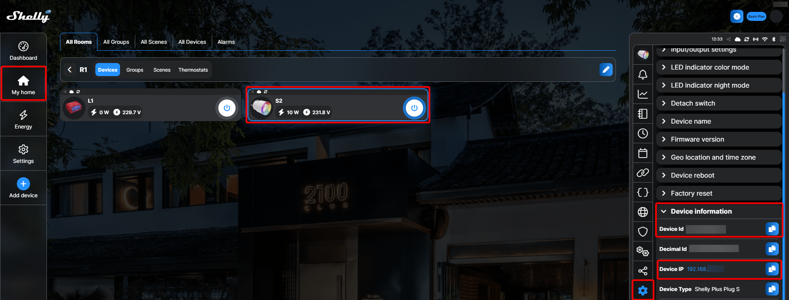

# Tutorials

[Back to Overview](README.md)

This page contains tutorials for specific use cases.


## HTTP action tutorials

### Turn on/off shelly plug

The shelly plug has a built-in wifi access point or can connect itself to a wifi access point. Furthermore, it runs a webserver and provides a REST API that can be used to turn the plug (electricity) on or off.


1. Get a shelly plus plug (see [UK model](https://www.shelly.com/en-de/products/product-overview/shelly-plus-plug-uk) or [Shelly Plug S](https://www.amazon.de/s?k=shelly+s+plug&adgrpid=71094184076&hvadid=352674859116&hvdev=c&hvlocphy=1000739&hvnetw=g&hvqmt=e&hvrand=3009423075800256500&hvtargid=kwd-910071249511&hydadcr=1608_1721139&tag=googhydr08-21&ref=pd_sl_2xiktl7icw_e)).
2. Plug it in and enable the shelly wifi access point according to the shelly plug manual.
3. Connect to the wifi access point of the shelly plug. 
4. Now the shally plug should be reachable through an ip address, e.g ```http://192.168.33.1```.
5. Turn on ```Editing mode```
6. Edit cell and got to ```Actions``` tab
7. Select ```HTTP action```
8. Enter ```http://192.168.33.1/relay/0?turn=toggle``` command into the field ```HTTP URL``` (see Fig 1).
9. Enter ```GET``` into the field ```HTTP method```.
10. Enter ```text/plain``` into the field ```HTTP Content-Type```.
9. Click on ```OK``` to save the action.
10. Turn off ```Editing mode```


Fig 1: HTTP action to toggle Shelly plug.
 
::: tip
You can also use dedicated on/off commands (see [Shelly 2 HTTP manual](https://shelly-api-docs.shelly.cloud/gen1/#shelly2)):
```
http://192.168.33.1/relay/0?turn=on
```
```
http://192.168.33.1/relay/0?turn=on
```
:::

## UART action tutorials

### Remote control (Infrared)

The following tutorial explains, how to create a remote control for a TV by sending Infrared commands to the Open Source microcontroller [Puck.js](https://www.puck-js.com/), which supports emitting infrared light codes out of the box. The commands can be directly copied from the [puckmote](https://asterics.github.io/puckmote/) online remote control database (modified version for AsTeRICS Grid).


*Figure 18: Pasting infrared command into action field and try out of command.*

1. Get a [Puck.js](https://www.puck-js.com) device (**not Puck.js Lite**) from the [official shop](https://shop.espruino.com/puckjs) or [another distributor](http://www.espruino.com/Order).
2. Follow the [Puck.js Getting Started Guide](https://www.espruino.com/Quick+Start+BLE#puckjs)
3. Enable Bluetooth on your host device
7. Turn on ```Editing mode```
8. Edit cell and got to ```Actions``` tab
9. Select ```UART action```
10. Select ```Bluetooth``` as ```UART Type```. 
4. Check if your device is contained in the [puckmote database](https://asterics.github.io/puckmote/).
5. Test infrared command of choice, e.g. click on ```Power On``` or ```On```.
6. Copy the ```Puck.IR(....);\n``` command.
11. Paste copied ```Puck.IR(....);\n``` command into the field ```Data```.
12. Click on ```OK``` to save the action.
13. Turn off ```Editing mode```

::: tip
You can actually send any Javascript command supported by the Puck.js device, see [Puck.js API Documentation](https://www.espruino.com/Puck.js).
:::

### Accessible toy

The following tutorial explains, how to create an accessible battery-powered toy (e.g. disco light, soap bubble machine or duplo train). The [Puck.js](https://www.puck-js.com/) device contains an on-board FET (transistor) and allows you to control medium current devices (up to 200mA) directly from Puck.js, without external components (see [Puck.js+FET tutorial](https://www.espruino.com/Puck.js+FET)).


*Fig 2: Demo of accessible disco light toy.*

1. Get a [Puck.js](https://www.puck-js.com) device (**not Puck.js Lite**) from the [official shop](https://shop.espruino.com/puckjs) or [another distributor](http://www.espruino.com/Order).
2. Get a battery-powered toy. (**The battery voltage must be below 20V**).
3. [Create a battery-interruptor DIY](https://www.upstate.edu/specialneeds/pdf/inclusive/2021_family-fun-series_create-your-own-battery-interrupter.pdf) (see Fig 3) and insert it at the flat side of the battery. For our example keep the wires open ended and don't solder the audio socket onto them. 
5. Connect the negative pole of the battery ```N1``` to the ```GND``` pin of the Puck.js device (see Figure 20).
6. Connect the positive pole of the battery ```P1```to the ```FET```of the Puck.js device (see Figure 20).
7. Turn on the on/off switch of the toy (if there is one).
8. Now the toy is ready to be switched by the transistor of the Puck.js device.
9. Open a grid and turn on ```Editing mode```
10. Edit cell and got to ```Actions``` tab
11. Select ```UART action```
12. Select ```Bluetooth``` as ```UART Type```. 
13. Enter ```FET.set();\n``` into the field ```Data```.
14. Click on ```OK``` to save the action.
15. Turn off ```Editing mode```


*Fig 19: Battery interrupter*


Fig 20: Wiring of battery interrupter and Puck.js

::: tip
* ```FET.set();\n```: will turn the toy on.
* ```FET.reset();\n```: will turn the toy off.
:::

::: tip
You can also buy already adapted toys e.g. from [enablingdevices](https://enablingdevices.com/product-category/adapted-toys-games/) or [Ariadne Inklusivshop](https://inklusiv-shop.ariadne.de/spiele/adaptiertes-spielzeug/?p=1).
In such a case the Puck.js pins must be soldered to an audio jack plug.
:::

::: warning
Electromagnetic devices (motors, solenoids, speakers, etc) let out big spikes of electricity when they are disconnected from power. While Puck.js's FET provides a certain level of protection (350mA) for this Back-EMF, if you're trying to power anything of any size with the FET pin we'd suggest you add your own diode across the pins of device that you're powering to help to protect your Puck.js.
:::

### FABI / FLipMouse

This tutorial explains, how to create a mouse movement using the button interface FABI or the mouth mouse FLipMouse. This currently only supports a wired serial connection to the device.

### Move mouse cursor to the right

1. Connect the device to a desktop/laptop computer using a USB cable.
2. Open a grid and turn on ```Editing mode```
3. Edit cell and got to ```Actions``` tab
4. Select ```UART action```
5. Select ```Bluetooth``` as ```UART Type```. 
6. Enter ```AT MX 100;\n``` into the field ```Data```.
7. Click on ```OK``` to save the action.
8. Turn off ```Editing mode```

::: tip
You can send any [FABI AT command](https://github.com/asterics/FABI/blob/master/FabiWare/commands.h) or [FLipMouse AT](https://github.com/asterics/FLipMouse/blob/master/FLipWare/commands.h) command (e.g. mouse click, keyboard input, slot change to remote control a Smartphone via Bluetooth HID, ...) that is supported.
:::

## Predefined actions

### Special parameters needed for Shelly devices

For using `Cloud control` of Shelly devices these special parameters are needed which can be found in the Shelly App:
* `Cloud address` and `Authorization cloud key`: navigate to `Settings -> User settings -> Access And Permissions -> Authorization cloud key`. There you'll find a button `Get key` which reveals the needed information after clicking:


* `Device ID`: can be found navigating to `My home -> [Room] -> [Device to control] -> Settings icon -> Device information`. This section also shows the local `Device address` needed for `Local control`:


[Back to Overview](README.md)