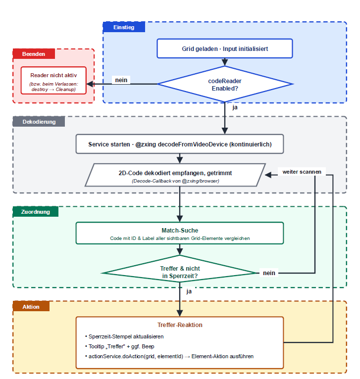

# Handheld-Code-Reader

Der Handheld-Code-Reader ist eine optionale Eingabemethode, die visuelle Codes
(DataMatrix, optional QR/Aztec) über eine USB-Kamera (z. B. ein Digitalmikroskop)
liest und damit das passende Grid-Element auslöst. Die Methode ist standardmäßig
deaktiviert und wird bei Bedarf in den Eingabe-Einstellungen eingeschaltet.

## Logischer Ablauf

## Scanvorlage zum Testen

Zum Ausprobieren liegt eine druckbare Kommunikationskarte mit Codes bei:
[kommunikationskarte-scanvorlage-essen-a4.pdf](kommunikationskarte-scanvorlage-essen-a4.pdf)

## Bachelorarbeit

Die Eingabemethode wurde im Rahmen folgender Bachelorarbeit entwickelt und evaluiert:

> Mete, Tahsin (2026): *Entwicklung und Evaluierung eines Hand-held-Readers für
> visuelle Codes im Kontext von Unterstützter Kommunikation.* Bachelorarbeit,
> Fachhochschule Technikum Wien, Studiengang Elektronik. Wien, 09.05.2026.

Die vollständige Arbeit ist nicht Teil dieses Repositories.
