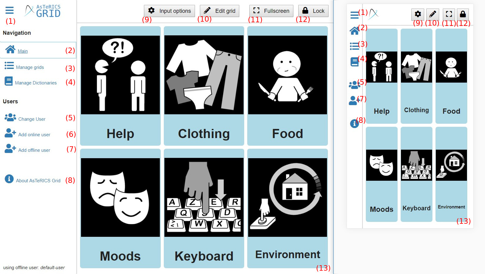
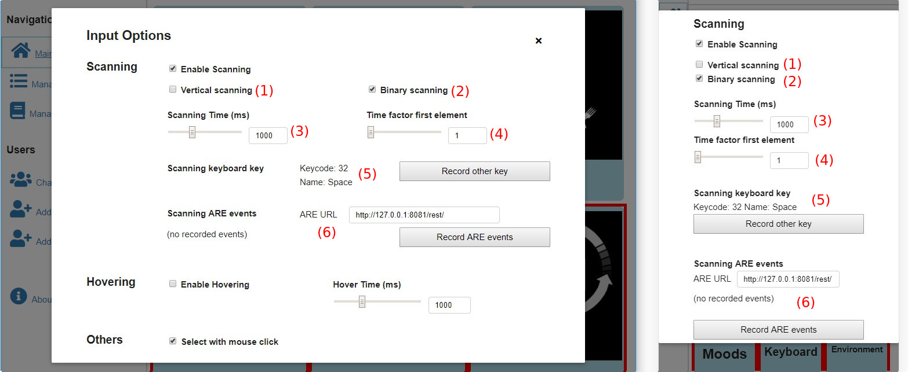
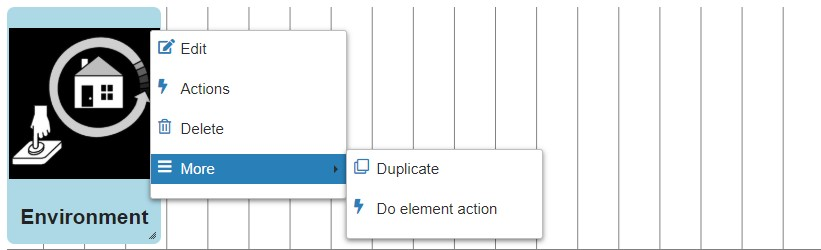
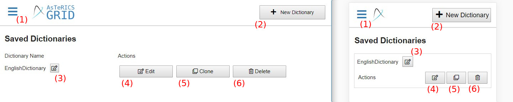

# Navigation and basic functionality

This chapter is about general appearance, navigation and basic functionality of the different views in AsTeRICS Grid:

1. [Welcome view](navigation.md#welcome-view): intial view shown at first usage
1. [Main view](navigation.md#main-view): starting view showing the recently used grid and navigation
1. [Input options](navigation.md#input-options): options about how to select grid elements
1. [Edit view](navigation.md#edit-view): view that allows modification of a grid
1. [Manage grids view](navigation.md#manage-grids-view): show all grids, create new ones, create a backup
1. [Manage dictionaries view](navigation.md#manage-dictionaries-view): show, edit and create new dictionaries
1. [Change user view](navigation.md#change-user-view): switch users or login an existing one
1. [Add online users](navigation.md#add-online-user): register new online users
1. [Add offline users](navigation.md#add-offline-user): add new offline users

[Back to Overview](index.md)

## Welcome view
AsTeRICS Grid initially starts with a welcome view giving the choice between:

1. **Use AsTeRICS Grid without registration:** choose this option in order to create a local default user and directly start using AsTeRICS Grid.
1. **Register now:** choose this option in order to sign up for an online user, which makes it possible to synchronize the grids across devices.

See [Terms](terms.md#User) for more information about offline/online users.

## Main view
Once taken a decision in the welcome view AsTeRICS Grid subsequently starts in the "main view" which looks like Figure 1 (desktop view on the left, mobile view on the right):

*Fig. 1: Main view*

The elements have this functionality:

1. Open or close the left navigation sidebar
1. **Main**: navigate to the main view (currently shown)
1. **[Manage grids](navigation.md#manage-grids-view)**: show all grids of the current user, add new ones or backup them to a file
1. **[Manage dictionaries](navigation.md#manage-dictionaries-view)**: show all saved dictionaries, edit them or add new ones
1. **[Change user](navigation.md#change-user-view)**: switch between saved users or log in an existing online user
1. **[Add online user](navigation.md#add-online-user)**: register a new online user (synchronized across devices)
1. **[Add offline users](navigation.md#add-offline-user)**: add a new offline user (only for this device)
1. **About AsTeRICS Grid**: Show general information, links, contact address
1. **[Input options](navigation.md#input-options)**: Options about how to select grid elements (e.g. click, hover, scanning)
1. **[Edit grid](navigation.md#edit-view)**: edit the layout of the grid, add new elements, actions for grid elements
1. **Fullscreen**: hide the sidebar and the bar on the top, only showing the current grid (Fig. 1, number 13)
1. **Lock**: lock the screen in order to prevent unintended input or changes beside using an navigating the grid (Fig. 1, number 13)
1. **Grid**: demo grid consisting of 6 grid elements which are navigating to other grids if selected

## Input Options
Clicking on Button "Input Options" (Fig. 1, number 9) opens a modal where input modalities can be configured:

These are the possible options:

1. **Enable Scanning**: enables the "scanning" method, which means that grid elements are consecutively highlighted and the user can select the desired element just by a single input channel, e.g. a single keyboard key or a tap anywhere on the touch-screen.
1. **Enable Hovering**: enables the "hovering" input method, which means that grid elements selected by keeping the mouse cursor positioned on an element for a specific amount of time. On a touchscreen it means that elements are selected by tap-and-hold on them for some duration.
1. **Hover Time**: the time in milliseconds to dwell on an element in order to select it (if hovering enabled)
1. **Select with mouse click**: selects an element by just clicking on it (tap on touchscreen)

### Scanning options
If scanning is enabled there are several additional options for this input method:

1. **Vertical scanning** defines the direction of scanning:
    * **vertical** (checked): groups are built vertical, moving left to right 

    * **horizontal** (unchecked): groups are built horizontal, moving top to bottom 

1. **Binary scanning** defines if scanning groups are rows/columns or one half of existing elements:
    * **binary** (checked): groups are built by separating remaining elements in two halves each scanning step 

    * **horizontal** (unchecked): groups are built row/column by row/column 

1. **Scanning Time**: time to wait between two scanning steps (in milliseconds)
1. **Time factor first element**: the time to keep the first scanning group (e.g. first row/column) highlighted is "Scanning Time" multiplied with this factor. Increasing the time for the first group often improves usability.
1. **Scanning keyboard key**: defines which key of the keyboard is used to select the currently highlighted scanning group (default: Space). To change press "Record other key" and press the desired key afterwards.
1. **Scanning ARE events**: makes it possible to select the current scanning group by any event from the [AsTeRICS Framework](terms.md#asterics-framework). Set it up this way:
    * Start the AsTeRICS Framework (ARE) with the desired model (e.g. a model generating an event when moving the head)
    * Click on "Record ARE Events" in AsTeRICS Grid
    * Trigger the desired event in the running model (AsTeRICS Framework), e.g. move the head
    * recored events are now listed in the AsTeRICS Grid input configuration, press OK in order to apply the changes
    * Scanning groups now can be selected by triggering the recorded event in the AsTeRICS Framework (e.g. moving the head)

## Edit view
Clicking on Button "Edit" (Fig. 1, number 9) opens the edit view where a grid can be adapted, see Figure 2:

*Fig.2: Edit view*

The following elements are available in the edit view:

1. Open or close the navigation sidebar
1. **Back**: navigate back to last view (either main view, or manage grids view)
1. **Undo**: reverts the last action
1. **Redo**: redoes the last action after reverting it
1. **More**: opens a menu with additional actions, e.g adding new elements
1. **Edit area**: Grid elements can be repositioned by dragging them (drap & drop). On the right bottom corner it's possible to resize a grid element.
1. **Right click on a grid element**: opens a menu for editing the element (open it with long tap on a mobile device/touchscreen)

### Adding elements and layout options
The following menu opens on a click on "More" (Fig. 2, number 5):

These are the actions to select in the menu:

1. **New &#x2192; New Element**: creates a normal new element, opening a dialog where label and image can be defined
1. **New &#x2192; Many new elements**: creates multiple new normal elements at once, opening a dialog where multiple elements can be defined and inserted into the grid
1. **New &#x2192; New collect element**: creates a new collect element, see [Terms](terms.md#grid-element)
1. **New &#x2192; New prediction element**: creates a new prediction element, see [Terms](terms.md#grid-element)
1. **Delete all elements**: removes all grid elements from the grid
1. **Add row to layout**: adds a new row to the grid layout, e.g. creating a new third row for elements at the bottom in Figure 2 

1. **Remove row from layout**: removes the last row from the grid layout while keeping all grid elements. Applied to Figure 2 this would mean that afterwards there is only a single row where all six elements are placed. 

1. **Fill gaps**: moves all grid elements as far left as possible, closing gaps. Applied to Figure 2 this would result in moving "Food" to the left, closing the gap between "Food" and "Clothing". 

### Editing grid elements
A right click (or long tap) on a grid element in edit view opens the following menu:

These are the options to select:

1. **Edit**: opens a dialog to edit the label and the image of this element
1. **Actions**: opens a dialog to edit actions that should be performed if this element is selected, see [Grid actions](actions.md)
1. **Delete**: deletes this element
1. **More &#x2192; Duplicate**: inserts a copy of this element to the grid
1. **More &#x2192; Do element action**: performs the actions that are assigned to this grid element, e.g. speaking the label or navigating to another grid

## Manage grids view
Clicking on Button "Edit" (Fig. 1, number 9) opens the edit view where a grid can be adapted, see Figure 2:

*Fig.3: Manage grids view*

The following elements are available in the manage grids view:

1. Open or close the navigation sidebar
1. **Search bar**: filter the listed grids by entering a part of a grid name
1. **New grid**: add a new, empty grid
1. **More**: showing menu with additional actions, e.g. backup the grids to file
1. **Edit grid name**: edit the name of the grid
1. **Show**: open this grid in main view
1. **Edit**: open this grid in edit view
1. **Clone**: duplicate this grid, creating a copy of it with a different name
1. **Delete**: deletes the grid
1. **Export**:  saves and downloads the specific grid to a .grd file creating a backup of it

Clicking on Button "More" (Fig. 3, number 4) opens menu with additional options:

These are the possible options:

1. **New grid**: creates a new and empty grid, same as Fig. 3, number 3
1. **Export all grids to file**: creates and downloads a file (.grd) containing a backup of all current grids
1. **Import grid(s) from file**: imports one or more grids from a .grd file in addition to currently existing grids
1. **Import backup from file**: imports one or more grids from a .grd file as a backup, deleting all current grids and only keeping the grids from the imported .grd file
1. **Reset to default configuration**: deletes all current grids and replaces them with the default demo configuration

## Manage dictionaries view
In the manage dictionaries view currently saved dictionaries that are used for filling prediction elements (see [Terms](terms.md#grid-element)) can be shown and adapted (Figure 4):

*Fig.4: Manage dictionaries view*

The following elements are available in the manage dictionaries view:

1. Open or close the navigation sidebar
1. **New dictionary**: add a new, empty dictionary
1. **Edit dictionary name**: change the name of a dictionary
1. **Edit**: show, edit and add new words to the dictionary
1. **Clone**: create a copy of the dictionary
1. **Delete**: removes the dictionary

<!-- For more information about using dictionaries see TODO -->

## Change user view
In the change user view it's possible to switch between users or login a new one (Figure 5):

*Fig.5: Change user view*

The following elements are available in the change users view:

1. Open or close the navigation sidebar
1. **Active offline user**: the currently active user is recognizable by a black user symbol and the word "active" next to the username. The active user is the user whose grids and configuration are currently used and shown in all other views. 
1. **Inactive online user**: The little cloud symbol indicates an online user (see [Terms](terms.md#user)) and the gray user symbol that he is currently inactive, meaning that the user's grids are currently not used.
1. **Inactive offline user**: The gray user symbol without a cloud indicates an inactive offline user (see [Terms](terms.md#user))
1. **Open**: sets the user "active" and opens the main view, showing the user's grid(s). Sets all other users inactive, there is always only one active user.
1. **Delete**: deletes the user and all of his grids and configuration. Use with caution, this action cannot be undone. This option is only available for offline users.
1. **Logout**: deletes the user and all of his grids and configuration, but only on the current device. Data in the cloud and on other devices that are logged in with the same user will not be deleted. This option is only available for online users.
1. **Login with other user**: put in username and password of an online user in order to add it to the current device. In order to create a new online or offline user, follow one of the links below.
1. **Remember checkbox**: if checked, the newly logged in online user will be saved to the device and listed in the list of users in the current user view. If unchecked the user will only be opened temporarily and no user data will be saved on the device (recommended for logging in on foreign devices).

## Add online user
In view "add online user" it's possible to register a new online user (see [Terms](terms.md#user)), Figure 6:

*Fig.6: Add online user view - register*

The following information is important for registering an online user:

* The only data that is needed are a **username** and a **password**. The username is needed for uniquely identifying a user and the password for securing his account and encrypting the data.
* If you want to **use AsTeRICS Grid completely anonymously** just use a username without relation to your person.
* Since all data is **end-to-end encrypted** only the user itself can ever see his data and configuration, no server admin or anyone else.
* End-to-end encryption is great for privacy, however it has the drawback that the **data is lost**, if you logout your online account on all devices and forget your password. In this case there is **no possibility of password recovery**, so **remember your password carefully**. It's also recommended to **do backups** of your grids (see [Manage grids view](navigation.md#manage-grids-view)).
* Usernames must start lowercase, valid characters are [a-z], [0-9] and ["-", "_"], valid length is 3-50 characters.

## Add offline user
In view "add offline user" it's possible add a new offline user (see [Terms](terms.md#user)), Figure 7:

*Fig.7: Add offline user view*

The following information is important regarding offline users:

* All **data of an offline user never leaves the device**, it's stored in a browser-internal database.
* Regulary **create backups** of your grids by exporting them to file, see [Manage grids view](navigation.md#manage-grids-view)
* Usernames must start lowercase, valid characters are [a-z], [0-9] and ["-", "_"], valid length is 3-50 characters.

[&#x2190; Previous Chapter](terms.md) [Next Chapter &#x2192;](appearance_layout.md)

[Back to Overview](index.md)

