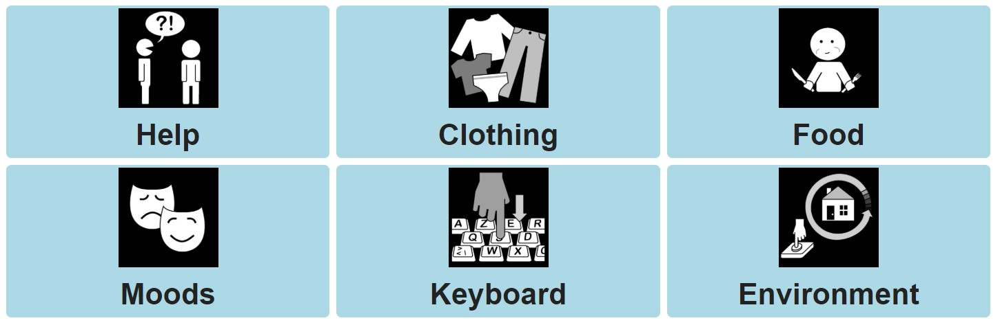

# Dynamic grid
This chapter is about the technical background of the dynamic grid system which visualizes grids and grid elements in AsTeRICS Grid.

1. [General](03_grid.md#general)
1. [GridList and grid.js](03_grid.md#gridlist-and-gridjs)
1. [Repositioning and resizing of elements](03_grid.md#repositioning-and-resizing-of-elements)

[Back to Overview](README.md)

## General
When opening AsTeRICS Grid in the main view the latest used grid is shown:

From a technical perspective this grid is a unordered list (`<ul>`) where each list element (`<li>`) represents a grid element. HTML representations for these grid elements are generated in [templates.js](https://github.com/asterics/AsTeRICS-Grid/blob/master/src/js/templates.js). 

## GridList and grid.js
Positioning of the grid elements is done by the [GridList library](https://github.com/klues/grid). It is initialized and used in the file [grid.js](https://github.com/asterics/AsTeRICS-Grid/blob/master/src/js/grid.js). All relevant code for functionalities like repositioning or resizing can be found there. Styling of the grid and it's elements is done by the [gridlist.css](https://github.com/asterics/AsTeRICS-Grid/blob/master/src/css/gridlist.css) stylesheet.

For undo and redo functionalities of the edit view [grid.js](https://github.com/asterics/AsTeRICS-Grid/blob/master/src/js/grid.js) uses the functions of the file [undoService.js](https://github.com/asterics/AsTeRICS-Grid/blob/master/src/js/service/data/undoService.js).

## Repositioning and resizing of elements
Repositioning of elements is already supported by default by the [GridList library](https://github.com/klues/grid). For resizing of elements the [Resizable](https://jqueryui.com/resizable/) functionality of jQueryUI is used. The code for connecting jQueryUI Resizable with GridList can be found in the function `getResizeOptions()` in the `resize` handler about at [grid.js:151](https://github.com/asterics/AsTeRICS-Grid/blob/master/src/js/grid.js#L151).

[&#x2190; Previous Chapter](02_tools.md) [Next Chapter &#x2192;](04_vuejs.md)

[Back to Overview](README.md)

