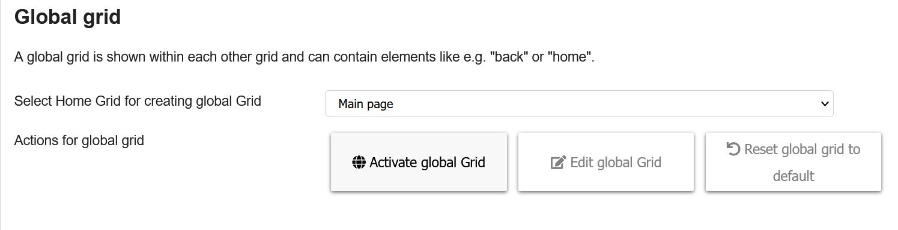
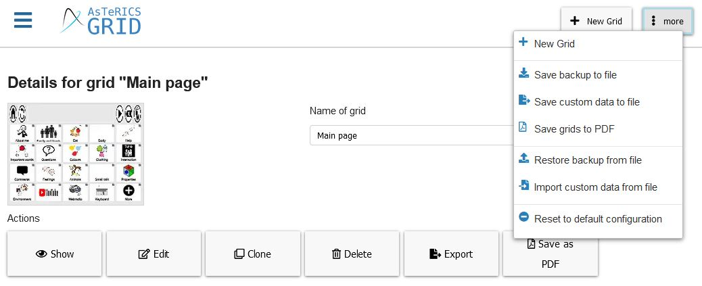

# Editing a Grid Set

This chapter explains how to change the appearance of a grid set and how to make backups.

- [Changing the Appearance](05_editing-grid-set.md#changing-the-appearance)
- [Changing the Global Grid](05_editing-grid-set.md#changing-the-global-grid)
- [Backup](05_editing-grid-set.md#backup)

[Back to Overview](README.md)

Options for editing a Grid set are located under `Settings -> Appearance` and in the `Manage grids` menu. 

## Changing the Appearance

The view `Settings -> Appearance` has two sections, the section `Text` allows to configure the appearance of texts in grid elements, `Grid element` allows to specify the general appearance of grid elements.

### Text appearance
There are the following options for text appearance:
* **Text position**: specify if labels of elements should be shown above or below images
* **Font family**: change the font family of the labels
* **Convert labels**: convert labels to lowercase or uppercase
* **Font size (text + image)**: specify the font size for elements containing both text and image. Font size is relative to the element height.
* **Font size (text-only)**: specify the font size for elements containing only text (also prediction elements). Font size is relative to the element height.
* **Mode for handling too long texts**: specifies what should happen if the element text is too long with the set font size.
   * **Adapt automatically**: reduces the font-size until it fits
   * **Truncate**: truncates text that is too long
   * **Ellipsis**: truncates text that is too long and indicates truncation with `...` at the end
* **Maximum number of lines**: the maximum number of lines the text of an element can have
* **Line height**: ratio of height of the text lines in elements to the font size. For instance `1.5` means that the vertical place for the text in an element is 50% higher than the text itself.
* **Font color**: color of text in elements
* **Auto-size keyboard letters**: if true, elements with no images and a single letter as label (e.g. `A`) are shown much bigger, improving the appearance of keyboard grids

### Grid element appearance
There are the following options for grid element appearance:
* **Default element background color**: background color of grid elements, if not specified on element level (custom color or color category color)
* **Default grid background color**: background color of grids, i.e. color between / behind grid elements
* **Color mode**: select if custom colors of grid elements should apply to the background or border
* **Default element border color**: border color of grid elements, if not specified on element level (custom color or color category color)
* **Border width**: with of grid element borders, percentage of current application window (screen) size
* **Space between elements**: space between grid elements, percentage of current application window (screen) size
* **Border radius**: roundness of borders of grid elements, percentage of current application window (screen) size
* **Color scheme for categories**: color scheme for word categories of elements
* **Activate color categories of grid elements**: activate / deactivate color schemes for word categories in general

To change the setup of the global grid and the collect element, check sections [editing grid](06_editing-grid.md) and [editing grid element](07_grid-elements.md).

## Changing the Global Grid

The global grid is usually shown on all grids and normally has elements like a home button, a collect element to show the current sentence and elements like a `back` or a `delete` button.

The global grid can be activated/deactivated and edited in the "Manage Grids" view at the bottom or by `More -> Edit global grid` while editing any other grid: 

*Figure 1: "Manage grids" view - Global Grid*

It can also be deactivated on specific grids. More information in [editing grid](06_editing-grid.md).

## Backup

We **highly recommend to do backups** if you are using AsTeRICS Grid on a regular basis and have put some effort into customizing own grids for your use case. This is why backups are important:

1. **Offline users**: since all data is only stored in an browser-internal storage, any browser crash or failure of your device could cause data loss.
2. **Online users**: Although online users are not susceptible to device or browser errors, data loss is still possible because of the end-to-end encryption of user data. If the user forgets his password or decryption fails because of any kind of programming error, the data cannot be recovered. Backups are saved to an unencrypted file and therefore can recover the user data in such cases.

To create a backup go to `Manage grids" -> "more" button`:

*Figure 2: "Manage grids" view - "more" button*

Clicking the `"more" button` shows the following options related to backups:
* **Save backup to file**: creates and downloads a `.grd` file containing a backup of all current grids, dictionaries and input configuration. The file is named `<username>_<date-and-time>_asterics-grid-full-backup.grd` allowing to identify to content and date of the backup.
* **Save custom data to file**: also creates and downloads a backup copy, but data can be customized with the following options: 
   * Select grid: export a specific (group of) grid(s) or all available grids
   * Export languages: select whether to export all the languages in which the communicator is translated or only one of them (current content language)
   * Export dictionaries: can be activated / deactivated
   * Export user settings and input configuration: can be activated / deactivated (preserves specific adjustments like color settings, content language or input settings (scanning or direct selection))
   * Export global grid: can be activated / deactivated 
* **Save grids to PDF**: creates and downloads a `.pdf` file of one or all grids, which can be used for later printing 
* **Restore backup from file**: deletes the existing configuration and replaces it with data from a `.grd` file. It's also possible to import data in the [Open Board Format (OBF)](https://www.openboardformat.org/), i.e. files with postfix `.obf` or `.obz`.
* **Import custom data from file**:  imports data from a `.grd` file as well, but data to import can be customized. You can choose if you want to import dictionaries, user settings and input configuration and if you want to delete existing data before importing.
* **Reset to default configuration**: deletes all current grids and replaces them with the default demo configuration, see [Choose How to Start View](03_basic_setup.md#choose-how-to-start-view)

[Back to Overview](README.md)