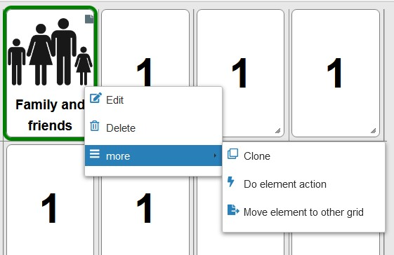
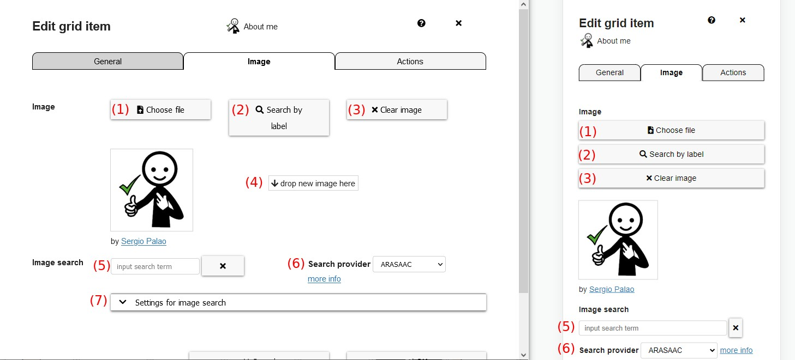
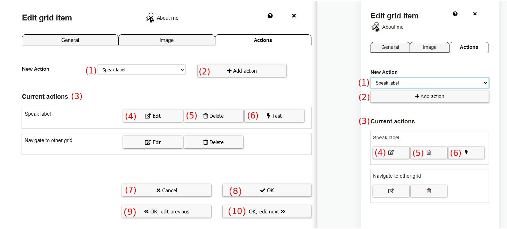

# Grid Elements

This chapter explains how to edit grid elements and explains various grid element types.

- [Normal Grid Elements](07_grid-elements.md#normal-grid-elements)
- [Collect Elements](07_grid-elements.md#collect-elements)
- [Prediction Elements](07_grid-elements.md#prediction-elements)
- [YouTube Player](07_grid-elements.md#youtube-player)

[Back to Overview](README.md)

## Edit menu for grid elements

All grid elements can be edited in the `edit view` ("Editing on").
After a right-click (or long tap) on a grid element, options for the element appear. These options can also be found at `more -> Selected element` in the right upper corner after selecting an element.

*Figure 1: Grid element menu in edit view*

These are the options to select:

1. **New**: right-click on an empty space allows to create a new element of a specific type
1. **Edit**: opens a dialog to edit the settings of this element
2. **Delete**: deletes this element
3. **Clone**: inserts a copy of this element to the grid
4. **Copy**: copies the element to clipboard
5. **Cut**: cuts the element (copies it to clipboard and removes it from the current grid)
6. **Paste**: paste element(s) from clipboard
7. **Set navigation**: link the element to an existing or a new grid
8. **Move element to other grid**: moves the element to another grid which can be selected (implemented earlier, now it's easier to use cut/copy/paste)
9. **Do element action**: performs the actions that are assigned to this grid element, e.g. speaking the label or navigating to another grid

Cut / Copy / Paste also works across users and browsers on the same device.

## Dialog "Edit grid element"

The dialog "Edit grid element" has different tabs, depending on the [type of the edited element](07_grid-elements.md#types-of-grid-elements):
* **General**: tab for general settings on the current element, content depends on element type.
* **Image**: tab for setting image of the element, only for element types `normal` and `live element`
* **Word forms**: tab for configuring word forms, only for elements of type `normal`
* **Actions**: tab setting actions which are performed if the element is selected, available for all element types
* **Live data**: tab for setting the source of live element data, only for `live elements`

The following chapters explain the most important tabs in more detail. Tabs specific to a single element type are explained below in within the description of the element types.

### Tab "General"

Clicking on "Edit" in the grid element menu (Fig. 1) opens the Tab *General* of the "Edit grid element" dialog. For element types `normal` and `live elements` the tab looks like this: 

*Figure 2: "Edit grid element" modal - Tab "General"*

These are the elements in the modal of Figure 2 (Tab *General*):

1. **Label**: change the label of the element shown under the image, can be empty
2. **Color category**: choose the color category (Noun, Verb, etc.)
3. **Search for images**: change to the *Image*-Tab. 
5. **Hide element**: if selected, the element will only be hidden in the normal view (used by AAC users) and only visible in the edit view
6. **Cancel**: discard all changes and close the dialog
7. **OK**: save all changes and close the dialog
8. **OK, edit previous**: save all changes, edit the previous grid element in the "Edit grid element" dialog - Tab "General"
9. **OK, edit next**: save all changes, edit the next grid element in the "Edit grid element" dialog - Tab "General"

Under advanced options, these additional options can be set:
* **Don't add element to collect element**: if selected, this element isn't added to the collect element after selection
* **Toggle in collection element if added multiple times**: Show/delete element in collect element each time the button is clicked.
* **Font size**: font size for this element, overrides font size set in [text appearance](05_editing-grid-set.md#text-appearance))
* **Background / border color**: choose a custom background color (or border color, for color mode `Color border`, see [grid element appearance](05_editing-grid-set.md#grid-element-appearance))
* **Font color**: font color for this element, overrides font color set in [text appearance](05_editing-grid-set.md#text-appearance))

### Tab "Image"

This tab is available for element types `normal` and `live elements` and allows to specify the image shown in an element:

*Figure 3: "Edit grid element" dialog - Tab "Image"*

1. **Choose file**: opens a file dialog to choose a different image
2. **Search by label**: image search is done by label
3. **Clear image**: deletes the currently chosen image
4. **Drop area**: drag and drop image files in this area to select them. It's possible to drag and drop files from a file explorer or also other programs
5. **Image Search**: type in the name of which images shall be looked for
6. **Search Provider**: select the provider for the image search
7. **Settings for image search**: select additional settings like Plural or Color (skin color, hair color,...)

### Tab "Actions"

The tab *Actions* configures the actions that will be performed if the grid element is selected (Figure 6). It's available for all element types:

*Figure 6: Edit Actions modal*

These are the elements in the action tab:

1. **New action**: select a new action to the grid, in the dropdown the action type has to be selected
2. **Add action**: adds the selected action type as a new action to the grid
3. **Current actions**: list of currently configured actions that will be performed if the grid element is selected
4. **Edit**: edit and configure the particular action
5. **Delete**: delete the action from this grid element
6. **Test**: tests the action, e.g. speaks the label. This button is not available for all types of actions.
7. **Cancel**: discard any changes and close the modal
8. **OK**: save all changes and close the modal
9. **OK, edit previous**: save all changes and edit the actions of the previous element
10. **OK, edit next**: save all changes and edit the actions of the next element

See the [chapter about actions](08_actions.md) for a detailed explanation of the possible actions and their configuration.

## Types of grid elements

This sections shortly describes the different types of grid elements, where each can have different tabs for editing.

### Normal Grid Elements

A normal grid element is an element that displays an image, a text label, or both, one below the other. Next to the possibilities for editing normal elements already described above, there is also a tab
`Word forms` in the "edit grid element" dialog, which allows to define and edit word forms for the current grid element, see details in chapter [word forms](07a_word-forms.md).

### Collect Elements

Collect elements are elements that collect items selected by the user. Normally only one collect element exists within the global grid, which could also be called "bar". For collect elements you have the following options in the tab "General":
- **Collect Mode**:
  - **Always Collect Separate Elements**: For elements with pictograms and labels, show each pictogram and label. For elements with a letter ( = keyboards) show each letter separatedly, e.g. "i" and "s" instead of "is"
  - **Collect Cohesive Text**: For elements with pictogramm and labels collect only the text. For elements with a letter connect the letter to one word.
  - **Automatic**: Recognize automatically what is needed.
- **Height of collected images [%]**: Decide how big images should be in comparison to the label.
- **Factor for font size of only-text elements in separated mode**: Controls font size in the collect element if both text and images are collected. Bigger numbers make text-only fonts bigger than text-and-images-font.
- **Show labels of collected images**: of not set, only images are shown in the collect element
- **Fully show long labels below images**: if set, labels below images in the collect element aren't truncated, if not set long labels are truncated with `...`
- **Use horizontal scrollbar if elements don't fit**: if set, a scrollbar is shown if collected elements don't fit, otherwise collected elements are shown in multiple lines
- **convert uppercase keyboard letters to lowercase**: if set, keyboard letters are converted to lowercase, allowing to write words with lowercase letters

In the `Actions` tab you can set actions that performed if the collect element is selected, most importantly the [Collect element action](08_actions.md#collect-element-action).

### Prediction Elements

Prediction elements are elements which show word predictions while typing using a keyboard grid. Most times nothing has to be configured at the prediction elements itself, but a [fill prediction elements action](08_actions.md#fill-prediction-elements) on other elements is used to fill the predictions into these elements.

### YouTube Player

A YouTube player allows to show videos from YouTube.
* `Tab General`: allows to decide if clicking on the YouTube player should be allowed. Preventing clicks on the player prevents AAC users to directly interact with the video and e.g. select a suggested video after a video has ended.
* `Tab Actions`: you can use a [YouTube action](08_actions.md#youtube-action) to directly start a video after selecting the YouTube player. Otherwise the shown videos can also be controlled via YouTube actions on other elements.

### Live Elements

A live element is an element that can display dynamic or external information. See separate [docs about live elements](07b_live-elements.md).

[Back to Overview](README.md)
