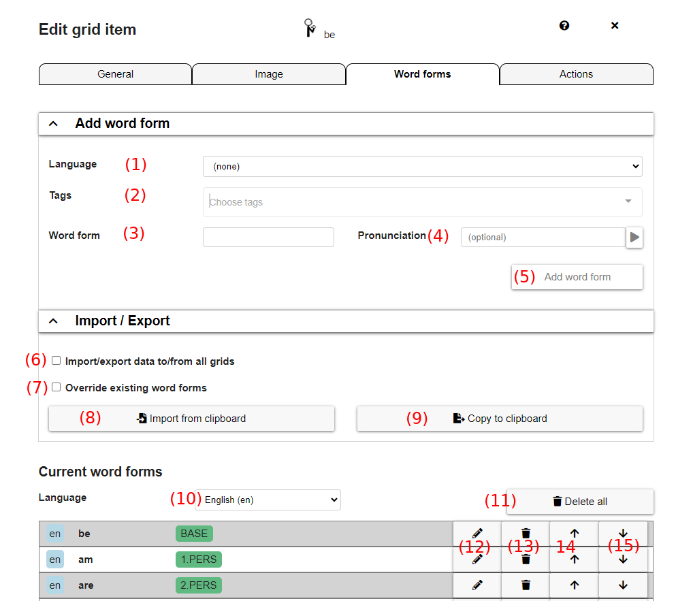
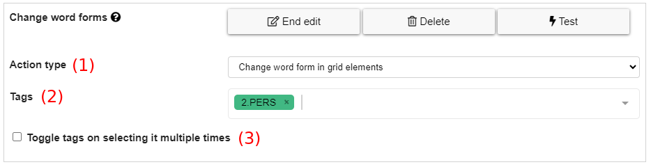

# Word forms in AsTeRICS Grid

For simple communication boards it's sufficient to use static labels (in different languages) for grid elements. However, for more advanced communicators "word forms" can be used in order to allow grammatically correct communication.

## General
Word forms can be defined for each element in the [dialog for editing grid elements](03_appearance_layout.md#editing-grid-elements). The tab `Word forms` allows to define and edit word forms (see Fig.1).

*Fig.1: Dialog for defining and editing word forms*

The dialog in Figure 1 shows the following options:
1. **Language**: (optional) language of the new word form
2. **Tags**: (optional) tags assigned to the new word form (e.g. `1.PERS` or `PLURAL`)
3. **Word form**: the value of the new word form
4. **Pronunciation**: (optional) alternative pronunciation for the new word form
5. **Add word form**: adds the newly defined word form to the list
6. **Import/export data to/from all grids**: if activated, word forms are not only imported/exported for the current element, but for all elements within all grids. This options helps to quickly edit all word forms (e.g. managed in an external spreadsheet). Note that data can only be imported to all grids (globally) if the data to import contains the fourth column `ID` (see below) and the target elements contain a word form with tag `BASE` (which is used for mapping the word forms correctly).
7. **Override existing word forms**: if activated, all existing word forms are overwritten at import. Always activated if importing globally.
8. **Import from clipboard**: imports word forms from the clipboard, copied from an external spreadsheet. The columns that can be imported are: `WORD FORM`, `LANG (2 digits)`, `TAGS (comma separated)`, `ID`, `PRONUNCIATION`. The order of columns is important, but not all have to be existing, so it's also possible to copy only the first ones. The value `ID` is only relevant for importing elements to all grids (globally) and it's automatically generated at exporting from all grids globally.
9. **Copy to clipboard**: copies word forms to the clipboard in a format that can be pasted to a spreadsheet.
10. **Language filter**: dropdown for selecting a language for filtering the list of word forms
11. **Delete all**: deletes all word forms of the current element
12. **Edit button**: enable/disable edit mode for a specific word form in the list
13. **Trash button**: delete a specific word form
14. **Up button**: moves the word form up within the list
15. **Down button**: moves the word form down within the list

## Word form actions
Once word forms are defined for different elements, they can be used and selected using the action type `change word forms` in tab `Actions` of the modal for editing a grid element (see Fig. 1). Figure 2 shows the possibilities for configuring this action.

*Fig.2: Configuring an action of type "Change word forms".*

### General function
In general most action types for `change word forms` allow it to define tags (Figure 2.2) which are added to an internal (hidden) list of current tags, if the action is performed.

**Example 1**: for example there could be the following elements within a grid:
* **Element "You"**: has action `change word forms` with tag `2.PERS`.
* **Element "Past"**: has action `change word forms` with tag `PAST`.
* **Element "to be"**: has defined various word forms with tags like `am [1.PERS, PRESENT]`, `are [2.PERS, PRESENT]`, `were [2.PERS, PAST]`.

Now using these elements would work as follows:
1. **Select element "You"**: tag `2.PERS` is added to internal list, word forms are changed in order to match this tag -> element "to be" is changed to `are` because it's the first word form including the tag `2.PERS`
2. **Select element "Past"**: tag `PAST` is added to internal list, which now includes `2.PERS, PAST`. Word forms are changed to match these tags -> element "to be" is changed to `were` because it's the first word form including the tags `2.PERS` and `PAST`.

### Action types
These are the action types for `change word forms` (Fig. 2.1):
* **Change word form in grid elements**: changes the labels of grid elements to the word form that best matches the current internal list of tags.
* **Change word form in collection element**: changes the last element in the collection element to the word form that best matches the current internal list of tags.
* **Change word form everywhere**: changes word forms both within grid elements and within the last word of the collect element.
* **Change this element to next word form**: doesn't use tags for selecting word forms, but simply iterates through the list of word forms defined within this element. *Example usage:* word forms contain a list of names, clicking on the element several times allows to select one of the names.
* **Reset currently displayed word forms**: resets the word forms, clears the tags currently stored within the internal list. This is done automatically each time an element is selected which doesn't include any `change word form` action.

Figure 2.3 shows an additional option `Toggle tags on selecting it multiple times`. If this option is activated, selecting this element several times in a row, toggles the tags of this action in the internal list. So in example 1 (see above) selecting the element "Past" multiple times would add and remove the tag `PAST` from the internal list, causing to toggle between the words `are` and `were`.

The action type `change this element to next word form` also has an option `secondary action type`. If selected, the tags of the current word form are used for a secondary action. *Example usage:* an element has 2 word forms `I [1.PERS]` and `You [2.PERS]`. Iterating through these values using `change this element to next word form` with `secondary action type` = `change word form in grid elements` will cause changing all other grid elements to `1.PERS` after selecting `I` and to `2.PERS` after selecting `You`.

## Example configuration
A grid configuration including examples for all word form features can be tested here:
<a href="https://grid.asterics.eu/?gridset_filename=grammar-demos.grd.json">Grid configuration with word form examples</a>. It contains examples for all different action types of `change word forms`.