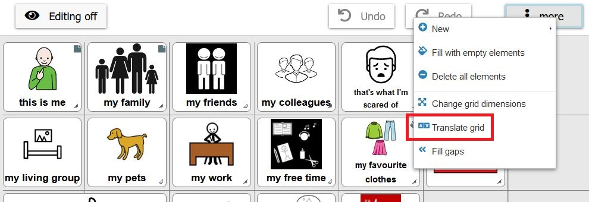
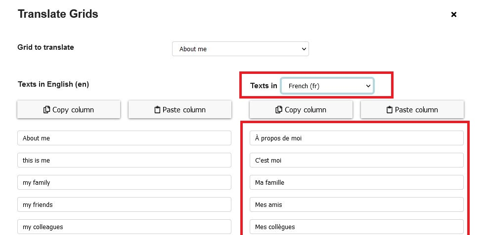
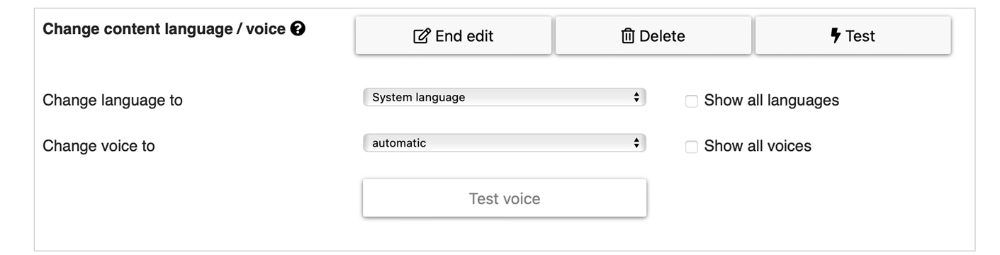
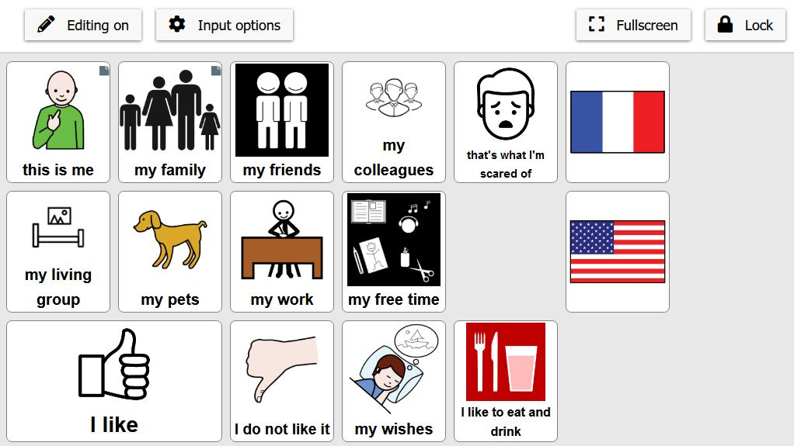
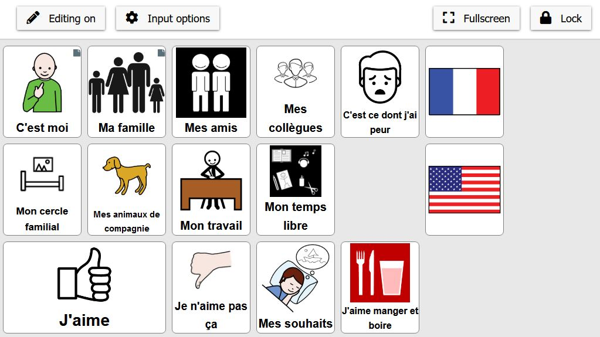

# Multilingual Grid Sets

[Back to Overview](README.md)

This chapter is about translating a grid (or grid set) and setting up the option to switch between the languages.

## Translating a Grid (or Grid Set)

To translate a grid or a grid set, go to `Editing on -> More (right top corner) -> Translate grid` (Figure 1)

*Figure 1: Translate grid option*

After clicking on the "Translate grid" option, the following window opens (Figure 2): 

*Figure 2: Translate grid - select language and translate the content*

The language, in which the grid content shall be translated, can be chosen on the right (Fig. 2). The column below shows the translations for the selected language. Missing translations can be filled inserted there. To translate the full grid set, select 'show all grids' from the dropdown list (Figure 3).

*Figure 3: Select all grids - copy paste*

Use the buttons `Copy column` and `Paste column` to copy/paste elements from/to a translation service like Google translate. This can greatly speed up the translation process. 

*Hint*: Google Translate has a character limit of 5000 after which you get an option with arrows to see the translation in batches. You can copy the elements into some external application (e.g. Excel, Notepad) and paste the translations in batches there. Then select the column with the translations and paste them in full. If the grid set has elements with no label that will also avoid a mismatch of translations, because they show up as line breaks when copying and Google Translate eliminates extra line breaks.

There are also special modes for copying and pasting the translations (buttons "copy/paste column"):
- `normal left click`: all rows are copied / pasted
- `Ctrl + click` on copy: copies only rows where the other language is empty
- `Ctrl + click` on paste: pastes only to empty rows
- `Ctrl + Shift + click` on copy/paste: copies and pastes the values including a generated key indicating the position and symbol of the element. This can be used if one wants to transfer translations between two not exactly equal configurations (e.g. some elements added)

## Switching Languages

To switch between languages, create a new element. Add a label and image (for example a flag of the country) as desired. In the 'actions' tab select the `change content language / voice` action from the dropdown list and add the action. This shows the following configuration possibilities (Figure 3):

*Figure 4: Configuration possibilites of action "change content language"*

These settings can be selected:
* **Change language to**: select the language to which the content language of the grids should be changed
* **Change voice to**: select the voice that should be used for the changed language
* **Show all languages**: if activated, all possible languages are shown. If not activated, only languages with existing translations are shown.
* **Show all voices**: if activated, all possible voices are shown. If not activated, only voices for the selected language are shown.

Also see [detailed information about voices](11_voices.md).

### Examples

In the following two figures an example is shown, where the content language can be switched from english to french or inversely by clicking on the corresponding flag (Figure 5 and 6). 

*Figure 5: Content language in English*

*Figure 6: Content language in French*

[Back to Overview](README.md)