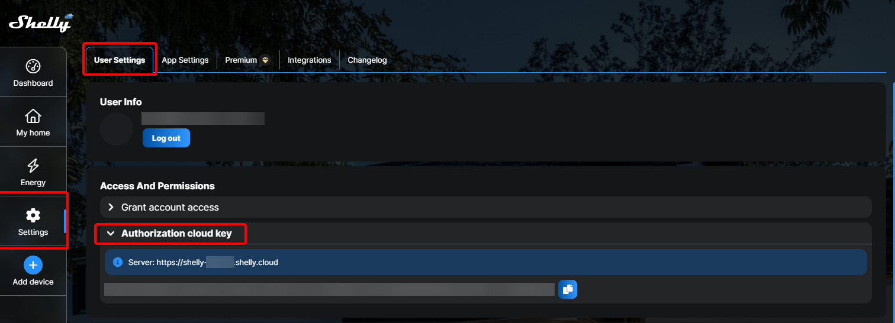
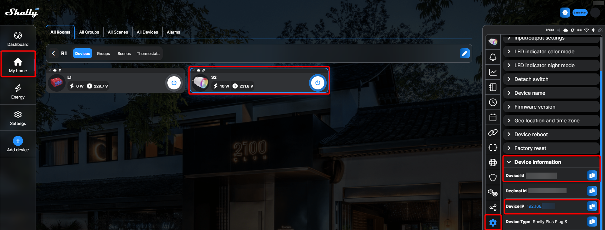

# Predefined action tutorials

This tutorial shows specific use cases for [predefined actions](../08_actions.md#predefined-actions).

## Special parameters needed for Shelly devices

For using `Cloud control` of Shelly devices these special parameters are needed which can be found in the Shelly App:
* `Cloud address` and `Authorization cloud key`: navigate to `Settings -> User settings -> Access And Permissions -> Authorization cloud key`. There you'll find a button `Get key` which reveals the needed information after clicking:

* `Device ID`: can be found navigating to `My home -> [Room] -> [Device to control] -> Settings icon -> Device information`. This section also shows the local `Device address` needed for `Local control`:
